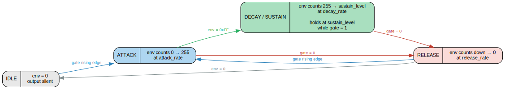

# SID Voice Synthesizer (TT-IHP)

Single SID voice with ADSR envelope, controlled via SPI, with a first-order
delta-sigma PDM audio output. Designed for a Tiny Tapeout 1x1 tile on the
IHP SG13G2 130nm process at 50 MHz.

[View the GDS layout](https://rrrh.github.io/tiny_sid_chip/)

---

## Table of Contents

1. [Overview](#overview)
2. [Architecture](#architecture)
3. [Pin Mapping](#pin-mapping)
4. [Module Descriptions](#module-descriptions)
5. [Register Reference](#register-reference)
6. [SPI Protocol](#spi-protocol)
7. [Audio Output and Delta-Sigma DAC](#audio-output-and-delta-sigma-dac)
8. [Usage Guide](#usage-guide)
9. [Design Constraints](#design-constraints)
10. [Physical Implementation (LibreLane PnR)](#physical-implementation-librelane-pnr)

---

## Overview

This design implements a single-voice sound synthesizer inspired by the
MOS 6581/8580 SID chip, the legendary audio IC from the Commodore 64. It
provides four classic waveform types (sawtooth, triangle, pulse, noise), a
full ADSR amplitude envelope, and ring modulation / hard sync control bits,
all packed into a Tiny Tapeout 1x1 tile.

A host microcontroller (Arduino, RP2040, ESP32, etc.) writes seven
SID-style control registers over a simple 3-wire SPI bus using compact
16-bit frames. The synthesized audio is output as a high-speed 1-bit
pulse-density modulated (PDM) stream that only requires a passive RC
low-pass filter to produce an analog signal suitable for headphones or a
line-level amplifier input.

### Key Features

- Four waveforms: sawtooth, triangle, pulse (variable width), noise (LFSR)
- OR-combining of simultaneous waveforms (matches real SID behavior)
- Ring modulation and hard sync control bits
- Full ADSR envelope with independent attack, decay, sustain, and release
- Linear envelope with power-of-2 rate scaling (16 rate settings per phase)
- 12-bit internal voice resolution, 8-bit envelope depth (20-bit product)
- First-order delta-sigma DAC: 1-bit PDM output, ~99 dB theoretical SNR
- 3-wire write-only SPI control interface (CPOL=0, CPHA=0, 16-bit frames)
- Single 50 MHz clock domain
- Fits in a Tiny Tapeout 1x1 tile (~27,000 um^2 on IHP SG13G2)

### Source Files

| File | Description |
|------|-------------|
| `src/tt_um_sid.v` | Top-level TT wrapper: pin mapping and module instantiation |
| `src/spi_regs.v` | SPI slave with 2FF synchronizers and write-only register bank |
| `src/sid_voice.v` | SID waveform generator: oscillator, waveform mux, envelope scaling |
| `src/sid_asdr_generator.v` | Simplified linear ADSR envelope state machine |
| `src/delta_sigma_dac.v` | First-order delta-sigma DAC (12-bit to 1-bit PDM) |

---

## Architecture


<details><summary>ASCII fallback</summary>

```
                         +-----------+     +-----------+     +-----------------+
  ui_in[0] spi_clk  --->|           |     |           |     |                 |
  ui_in[1] spi_cs_n --->| spi_regs  |---->| sid_voice |---->| delta_sigma_dac |---> uo_out[1] pdm_out
  ui_in[2] spi_mosi --->|           |     |           |     |                 |
                         +-----------+     +-----------+     +-----------------+
                          7 registers       12-bit voice      1-bit PDM stream
                          (write-only)      output
```

</details>

**Signal flow:**

1. The host sends 16-bit SPI write transactions to `spi_regs`, which
   synchronizes the SPI signals into the 50 MHz clock domain and latches
   the 8-bit data into one of seven byte-addressed control registers.

2. `sid_voice` reads those registers every clock cycle. A 24-bit phase
   accumulator generates the master oscillator, from which the four
   waveform generators derive their outputs. The selected waveform(s) are
   OR-combined into a 12-bit waveform value, then multiplied by the 8-bit
   ADSR envelope to produce a 20-bit product. The top 12 bits become the
   voice output.

3. `delta_sigma_dac` converts the 12-bit voice sample into a 1-bit PDM
   stream at the full 50 MHz clock rate. Externally, a simple RC low-pass
   filter recovers the analog audio.

---

## Pin Mapping

### Input Pins (`ui_in`)

| Pin | Signal | Description |
|-----|--------|-------------|
| `ui_in[0]` | `spi_clk` | SPI clock (CPOL=0, CPHA=0). Max frequency depends on system clock; must be < clk/4 for reliable synchronization. |
| `ui_in[1]` | `spi_cs_n` | SPI chip select, active low. Pull high when idle. |
| `ui_in[2]` | `spi_mosi` | SPI data input (master out, slave in). MSB first. |
| `ui_in[7:3]` | -- | Unused. Active low internally. |

### Output Pins (`uo_out`)

| Pin | Signal | Description |
|-----|--------|-------------|
| `uo_out[0]` | `spi_miso` | Tied low. SPI is write-only; no read-back. |
| `uo_out[1]` | `pdm_out` | Delta-sigma PDM audio output. Connect to RC filter. |
| `uo_out[7:2]` | -- | Tied low. |

### Bidirectional Pins (`uio`)

| Pin | Signal | Description |
|-----|--------|-------------|
| `uio[7:0]` | -- | Unused. Output enable = 0 (all configured as inputs, no drive). |

---

## Module Descriptions

### `tt_um_sid` (Top Level)

The Tiny Tapeout wrapper. Connects the SPI bus pins to `spi_regs`, wires
the seven register outputs to `sid_voice`, feeds the 12-bit voice output
into `delta_sigma_dac`, and maps `pdm_out` to `uo_out[1]`. All unused pins
are tied to safe defaults (outputs low, bidirectional pins set as inputs).

### `spi_regs` (SPI Register Bank)

A write-only SPI slave that accepts 16-bit transactions. The frame format
is `{addr[2:0], 5'b0, data[7:0]}`. All three SPI signals (`spi_clk`,
`spi_cs_n`, `spi_mosi`) pass through 2-stage flip-flop synchronizers
before processing, making the interface safe across clock domains. Rising
edges of `spi_clk` are detected in the system clock domain via a 3-stage
pipeline and edge comparator.

16-bit frequency and pulse width values are split into low/high byte
register pairs (addresses 0/1 and 2/3 respectively).

Transaction state resets whenever `spi_cs_n` goes high (inactive), so
partial or corrupted transactions are safely discarded.

### `sid_voice` (Waveform Generator)

Implements the core SID voice:

- **24-bit phase accumulator**: Increments by `frequency` every clock cycle.
  The upper bits drive the waveform generators.
- **Sawtooth**: Top 12 bits of the accumulator (`accumulator[23:12]`).
- **Triangle**: Bits `[22:11]` XORed with a mask derived from `accumulator[23]`
  (or `accumulator_msb_in` when ring modulation is active).
- **Pulse**: Comparator output -- high when `accumulator[23:12] > duration[11:0]`.
  The `duration` register sets the pulse width (duty cycle).
- **Noise**: 23-bit LFSR (taps at bits 17 and 22) clocked by `accumulator[19]`.
  Outputs bits `[22:11]` of the LFSR as a 12-bit pseudo-random value.
- **Waveform mux**: Selected waveforms are OR-combined (matching real SID
  behavior where enabling multiple waveforms simultaneously produces the
  bitwise OR of their outputs).
- **Envelope scaling**: The 12-bit waveform value is multiplied by the 8-bit
  ADSR envelope value, producing a 20-bit result. The top 12 bits
  (`[19:8]`) are output as the voice signal.

The `IS_8580` parameter is provided for future use (currently hardcoded to 0
for 6581 behavior).

### `sid_asdr_generator` (ADSR Envelope)

A simplified linear ADSR envelope generator with four states:



<details><summary>ASCII fallback</summary>

```
IDLE --[gate rising edge]--> ATTACK --[env=0xFF]--> DECAY --[gate low]--> RELEASE --[env=0]--> IDLE
                                 |                    |                       ^
                                 +--[gate low]--------+                       |
                                                                              |
                                                      +--[gate rising edge]---+
```

</details>

**Timing mechanism:** A free-running 23-bit prescaler increments every
clock cycle. The 4-bit rate value selects which prescaler bits to check:
rate N fires an envelope tick when all of `prescaler[N+8:0]` are 1, i.e.,
every 2^(N+9) clock cycles. This gives a range from ~2.6 ms (rate 0) to
~86 s (rate 15) for a full 256-step envelope traverse at 50 MHz.

- **ATTACK**: Increments `env_counter` from 0 to 255 at the attack rate.
- **DECAY**: Decrements `env_counter` toward the sustain level at the decay rate.
  Holds at the sustain level while gate remains high (sustain phase).
- **RELEASE**: Decrements `env_counter` from current value to 0 at the release rate.

The sustain level is the upper 4 bits of the sustain register value,
zero-extended to 8 bits (`{sustain_value, 4'h0}`), giving 16 sustain
levels in steps of 16 (0, 16, 32, ..., 240).

### `delta_sigma_dac` (Delta-Sigma DAC)

A minimal first-order delta-sigma modulator. The entire operation is:

```verilog
{pdm_out, acc} <= acc + din;
```

On each clock cycle, the 12-bit input sample is added to a 12-bit
accumulator. The carry (overflow) bit becomes the PDM output. Higher
input values produce more frequent carry pulses, encoding the amplitude
as pulse density.

---

## Register Reference

The seven registers are written via SPI using a 3-bit address (0--6).
All registers are 8-bit. The 16-bit frequency and pulse width values are
split into low/high byte pairs.

### Register 0: Frequency Low Byte (8-bit)

```
Bit:   7    6    5    4    3    2    1    0
     [              frequency[7:0]            ]
```

### Register 1: Frequency High Byte (8-bit)

```
Bit:   7    6    5    4    3    2    1    0
     [             frequency[15:8]            ]
```

The combined 16-bit frequency is the phase accumulator increment. Added
to the 24-bit accumulator every clock cycle, so the oscillator frequency is:

```
f_out = frequency * f_clk / 2^24
```

At 50 MHz:

| Frequency Register | Output Frequency | Note |
|---------------------|-----------------|------|
| 0x0000 | 0 Hz | Silence |
| 0x0112 | ~16.35 Hz | C0 |
| 0x10C3 | ~261.6 Hz | C4 |
| 0x1CD6 | ~440 Hz | A4 (concert pitch) |
| 0xFFFF | ~3051.76 Hz | Maximum fundamental |

**Frequency calculation:**
```
frequency_reg = round(f_desired * 2^24 / 50000000)
```

To write e.g. 4291 (0x10C3): write 0xC3 to register 0, then 0x10 to register 1.

### Register 2: Pulse Width Low Byte (8-bit)

```
Bit:   7    6    5    4    3    2    1    0
     [              duration[7:0]             ]
```

### Register 3: Pulse Width High Byte (8-bit)

```
Bit:   7    6    5    4    3    2    1    0
     [             duration[15:8]             ]
```

Only bits `[11:0]` of the combined 16-bit value are used. Sets the pulse
waveform duty cycle by comparison with `accumulator[23:12]`:

- `duration = 0x000`: Pulse is always low (0% duty cycle, silent)
- `duration = 0x800`: 50% duty cycle (classic square wave)
- `duration = 0xFFF`: Pulse is almost always high (~100% duty, nearly DC)

To write e.g. 2048 (0x0800): write 0x00 to register 2, then 0x08 to register 3.

### Register 4: Attack / Decay Rates (8-bit)

```
Bit:   7    6    5    4    3    2    1    0
     [  decay_rate[3:0]  ][attack_rate[3:0] ]
```

| Field | Bits | Description |
|-------|------|-------------|
| `attack_rate` | `[3:0]` | Controls how fast the envelope rises from 0 to 255 |
| `decay_rate` | `[7:4]` | Controls how fast the envelope falls from 255 to the sustain level |

Both fields use the same 4-bit rate encoding (see [Envelope Rate Table](#envelope-rate-table)).

### Register 5: Sustain Level / Release Rate (8-bit)

```
Bit:   7    6    5    4    3    2    1    0
     [ release_rate[3:0] ][sustain_value[3:0]]
```

| Field | Bits | Description |
|-------|------|-------------|
| `sustain_value` | `[3:0]` | Sustain amplitude level (0--15). Mapped to 8-bit as `{value, 4'h0}`: 0=0, 1=16, ..., 15=240. |
| `release_rate` | `[7:4]` | Controls how fast the envelope falls from the current level to 0 after gate off. |

The sustain level is the amplitude the envelope holds at after the decay
phase completes, for as long as the gate remains high. Setting sustain to
15 (0xF) means the envelope stays near maximum after attack; setting it to
0 means the sound decays to silence even while the gate is held.

### Register 6: Waveform Control (8-bit)

```
Bit:   7      6      5        4        3     2     1     0
     [noise][pulse][sawtooth][triangle][test][ring][sync][gate]
```

| Bit | Name | Description |
|-----|------|-------------|
| 0 | `gate` | **Gate control.** Set to 1 to start a note (triggers attack phase). Clear to 0 to release (triggers release phase). The attack phase begins on the rising edge of gate. |
| 1 | `sync` | **Hard sync.** When enabled, the oscillator accumulator resets on the falling edge of `accumulator_msb_in` (from another voice). In this single-voice design, `accumulator_msb_in` is tied to 0, so sync has no effect. |
| 2 | `ring` | **Ring modulation.** Modifies the triangle waveform by XORing with `accumulator_msb_in` instead of the local oscillator MSB. In this single-voice design, `accumulator_msb_in` is tied to 0, so ring mod inverts the triangle waveform. |
| 3 | `test` | **Test bit.** Forces the oscillator accumulator and LFSR to reset. While held high, the oscillator is frozen at 0 and noise output is reset. Useful for synchronizing or silencing. |
| 4 | `triangle` | **Enable triangle waveform.** Produces a triangle wave from the phase accumulator. |
| 5 | `sawtooth` | **Enable sawtooth waveform.** Produces a ramp (sawtooth) wave from the accumulator upper bits. |
| 6 | `pulse` | **Enable pulse waveform.** Produces a pulse/square wave; duty cycle set by registers 2/3. |
| 7 | `noise` | **Enable noise waveform.** Produces pseudo-random noise from a 23-bit LFSR. |

**Waveform combining:** When multiple waveform bits are set simultaneously,
their 12-bit outputs are bitwise OR-combined. This matches the real SID
chip behavior and produces distinctive (often harsh) timbres. Common useful
combinations:

- Single waveform (triangle, sawtooth, pulse, or noise) -- clean tones
- Triangle + sawtooth -- produces a characteristic SID "combined" timbre
- Pulse alone with varying width -- the most versatile SID sound

### Envelope Rate Table

All rate fields (attack, decay, release) use this mapping. The time listed
is the duration for a full 256-step traverse of the envelope at 50 MHz.

| Rate Value | Prescaler Period | Envelope Time (256 steps) | Typical Use |
|------------|------------------|---------------------------|-------------|
| 0 | 2^9 = 512 clocks | ~2.6 ms | Instantaneous percussive attack |
| 1 | 2^10 = 1024 | ~5.2 ms | Very fast |
| 2 | 2^11 = 2048 | ~10.5 ms | Fast |
| 3 | 2^12 = 4096 | ~21 ms | Quick pluck |
| 4 | 2^13 = 8192 | ~42 ms | Medium-fast |
| 5 | 2^14 = 16384 | ~84 ms | Medium |
| 6 | 2^15 = 32768 | ~168 ms | Moderate |
| 7 | 2^16 = 65536 | ~336 ms | Slow attack |
| 8 | 2^17 = 131072 | ~671 ms | Slow |
| 9 | 2^18 = 262144 | ~1.3 s | Very slow |
| 10 | 2^19 = 524288 | ~2.7 s | Pad-style |
| 11 | 2^20 = 1048576 | ~5.4 s | Long pad |
| 12 | 2^21 = 2097152 | ~10.7 s | Very long |
| 13 | 2^22 = 4194304 | ~21.5 s | Extreme |
| 14 | 2^23 = 8388608 | ~43 s | Ultra slow |
| 15 | 2^23 = 8388608 | ~43 s | Same as 14 (clamped) |

Formula: `envelope_time = 256 * 2^(rate+9) / 50000000` seconds.

---

## SPI Protocol

### Physical Layer

- **Mode:** CPOL=0, CPHA=0 (SPI Mode 0). Clock idle low; data sampled on rising edge.
- **Bit order:** MSB first.
- **Bus signals:** `spi_clk` (clock), `spi_cs_n` (chip select, active low), `spi_mosi` (data in).
- **MISO:** Permanently tied low. No read-back capability.
- **Clock speed:** The SPI clock must be slower than `clk/4` (< 12.5 MHz at 50 MHz system clock) due to the 2FF synchronizer and edge detection pipeline. Speeds up to 10 MHz are recommended for reliable operation.

### Transaction Format

Each write is a 16-bit (2-byte) transaction with `spi_cs_n` held low for
the entire transfer:

```
         Byte 0                 Byte 1
  CS_n  __|                                   |__
         |                                     |
  MOSI  [A2][A1][A0][x][x][x][x][x] [D7][D6]...[D0]
         ^                                     ^
       bit 15                                bit 0
```

| Byte | Bits | Field | Description |
|------|------|-------|-------------|
| 0 | `[7:5]` | A | Register address (0--6). |
| 0 | `[4:0]` | -- | Reserved (ignored). |
| 1 | `[7:0]` | D | 8-bit register data. |

**Important:** The register write takes effect on the 16th rising edge of
`spi_clk`. After the transaction, deassert `spi_cs_n` (drive high) before
starting the next transaction. The internal state machine resets on
`spi_cs_n` going high.

### Timing Diagram

```
spi_cs_n  ‾‾‾\___________________________/‾‾‾‾
                                           ^
spi_clk   ____/‾\_/‾\_/ ... \_/‾\_/‾\____
              1   2         15  16
                                 ^
                                 register written

spi_mosi  ----<A2><A1><A0><x><x><x><x><x><D7><D6>...<D1><D0>----
```

---

## Audio Output and Delta-Sigma DAC

### How It Works

The delta-sigma DAC is a first-order noise-shaping modulator. The core
operation is a single addition per clock cycle:

```
{carry, accumulator} <= accumulator + input_sample
```

The carry bit is the 1-bit PDM output. When the input sample is large,
the accumulator overflows (carry=1) more frequently, producing a higher
density of "1" pulses. When the input is small, carries are rare, producing
mostly "0" pulses. The time-averaged density of 1s is proportional to the
input amplitude.

### Signal Characteristics

| Parameter | Value |
|-----------|-------|
| Input resolution | 12 bits (unsigned, 0--4095) |
| Output | 1-bit PDM at 50 MHz |
| Oversampling ratio (OSR) | 50 MHz / (2 x 20 kHz) = 1250 |
| Theoretical SNR | ~69 dB (12-bit) + ~30 dB (1st-order shaping at OSR 1250) = ~99 dB |
| Quantization noise floor | Shaped to high frequencies, removed by external LP filter |

### External Reconstruction Filter

The PDM output is a 50 MHz digital signal swinging between 0 and VDD
(typically 3.3V or 1.8V depending on the TT I/O standard). To recover the
audio, connect a simple passive RC low-pass filter:

```
uo_out[1] ---[R]---+---> Audio Out
                    |
                   [C]
                    |
                   GND
```

**Recommended component values:**

| Cutoff Target | R | C | -3 dB Frequency |
|---------------|---|---|-----------------|
| 20 kHz | 1.0 kOhm | 8.2 nF | 19.4 kHz |
| 24 kHz | 1.0 kOhm | 6.8 nF | 23.4 kHz |
| 34 kHz (recommended) | 1.0 kOhm | 4.7 nF | 33.9 kHz |

A cutoff around 20--34 kHz passes the full audio band while attenuating
the high-frequency quantization noise. A single-pole RC filter provides
-20 dB/decade rolloff. For better noise rejection, a second-order filter
(two cascaded RC stages or a Sallen-Key active filter) can be used, but is
usually not necessary for casual listening.

**AC coupling:** If connecting to an amplifier input, add a DC blocking
capacitor (e.g., 10 uF electrolytic or 1 uF ceramic) in series after the
RC filter. The SID voice output is unsigned, so the DC offset is
approximately VDD/2 at mid-volume.

---

## Usage Guide

### Minimal Wiring

```
MCU                    TT Chip                   Audio
-----------           ----------------          -------
GPIO (SCK)  --------> ui_in[0] spi_clk
GPIO (CS)   --------> ui_in[1] spi_cs_n
GPIO (MOSI) --------> ui_in[2] spi_mosi
                       uo_out[1] pdm_out ----[1kOhm]---+---> headphones / amp
                                                        |
                                                      [4.7nF]
                                                        |
                                                       GND
```

No pull-up or pull-down resistors are needed on the SPI lines. The chip's
internal synchronizers handle signal conditioning.

### SPI Write Function (C / Arduino Example)

```c
// Write an 8-bit value to a SID register (address 0-6)
void sid_write(uint8_t addr, uint8_t data) {
    uint16_t word = ((addr & 0x07) << 13) | data;
    uint8_t byte0 = (word >> 8) & 0xFF;
    uint8_t byte1 = word & 0xFF;

    digitalWrite(CS_PIN, LOW);
    SPI.transfer(byte0);
    SPI.transfer(byte1);
    digitalWrite(CS_PIN, HIGH);
}

// Write a 16-bit frequency as two byte registers
void sid_write_freq(uint16_t freq) {
    sid_write(0, freq & 0xFF);        // freq_lo
    sid_write(1, (freq >> 8) & 0xFF); // freq_hi
}

// Write a 16-bit pulse width as two byte registers
void sid_write_pw(uint16_t pw) {
    sid_write(2, pw & 0xFF);          // pw_lo
    sid_write(3, (pw >> 8) & 0xFF);   // pw_hi
}
```

Ensure SPI is configured for Mode 0, MSB first, at <= 10 MHz.

### Playing a Note

To play a single note, configure the voice registers and then set the gate
bit. To stop the note, clear the gate bit to trigger the release phase.

```c
// Configure a 440 Hz sawtooth note with moderate ADSR
sid_write_freq(0x0241);  // Frequency = 440 Hz
sid_write_pw(0x0800);    // Pulse width = 50% (unused for sawtooth)
sid_write(4, 0x22);      // Attack=2 (~10ms), Decay=2 (~10ms)
sid_write(5, 0x2A);      // Sustain=10 (160/255), Release=2 (~10ms)
sid_write(6, 0x21);      // Sawtooth + gate ON

delay(500);              // Hold note for 500 ms

sid_write(6, 0x20);      // Sawtooth + gate OFF (release begins)
```

### Sound Recipes

Below are some starting-point register settings for common sounds.

#### Simple Square Wave (8-bit Game Style)

```c
sid_write_freq(freq);    // Desired frequency
sid_write_pw(0x0800);    // 50% duty cycle
sid_write(4, 0x00);      // Attack=0 (instant), Decay=0 (instant)
sid_write(5, 0x0F);      // Sustain=15 (max), Release=0 (instant)
sid_write(6, 0x41);      // Pulse waveform + gate ON
```

#### Bass (Pulse with Slow Attack)

```c
sid_write_freq(0x0056);  // ~65 Hz (low C)
sid_write_pw(0x0400);    // 25% duty cycle (nasal/thin bass)
sid_write(4, 0x53);      // Attack=3 (~21ms), Decay=5 (~84ms)
sid_write(5, 0x38);      // Sustain=8 (128/255), Release=3 (~21ms)
sid_write(6, 0x41);      // Pulse + gate ON
```

#### Pad (Triangle with Long Attack/Release)

```c
sid_write_freq(freq);    // Desired frequency
sid_write(4, 0x47);      // Attack=7 (~336ms), Decay=4 (~42ms)
sid_write(5, 0x6C);      // Sustain=12 (192/255), Release=6 (~168ms)
sid_write(6, 0x11);      // Triangle + gate ON
```

#### Drum / Percussion Hit (Noise with Fast Decay)

```c
sid_write_freq(0x4000);  // High frequency for dense noise texture
sid_write(4, 0x30);      // Attack=0 (instant), Decay=3 (~21ms)
sid_write(5, 0x20);      // Sustain=0 (full decay to silence), Release=2
sid_write(6, 0x81);      // Noise + gate ON
// After ~30ms the sound naturally decays to silence
sid_write(6, 0x80);      // Gate OFF
```

#### SID-Style Lead (Pulse with PWM Sweep)

For the classic SID "PWM lead" sound, sweep the pulse width register over
time from your host MCU:

```c
sid_write_freq(freq);
sid_write(4, 0x22);      // Attack=2, Decay=2
sid_write(5, 0x2B);      // Sustain=11, Release=2
sid_write(6, 0x41);      // Pulse + gate ON

// Sweep pulse width in a loop
for (uint16_t pw = 0x200; pw < 0xE00; pw += 0x10) {
    sid_write_pw(pw);
    delay(5);            // ~5ms per step
}
```

### Frequency Table (Equal Temperament at A4=440 Hz)

Register values for standard musical notes at 50 MHz system clock:

| Note | Oct 2 | Oct 3 | Oct 4 | Oct 5 | Oct 6 |
|------|-------|-------|-------|-------|-------|
| C | 0x0056 | 0x00AB | 0x0156 | 0x02AC | 0x0558 |
| C# | 0x005B | 0x00B5 | 0x016A | 0x02D5 | 0x05AA |
| D | 0x0060 | 0x00C0 | 0x0180 | 0x0300 | 0x0601 |
| D# | 0x0066 | 0x00CC | 0x0198 | 0x032F | 0x065E |
| E | 0x006C | 0x00D8 | 0x01B0 | 0x0361 | 0x06C2 |
| F | 0x0073 | 0x00E5 | 0x01CA | 0x0395 | 0x072A |
| F# | 0x0079 | 0x00F3 | 0x01E6 | 0x03CC | 0x0799 |
| G | 0x0080 | 0x0101 | 0x0203 | 0x0406 | 0x080C |
| G# | 0x0088 | 0x0110 | 0x0221 | 0x0443 | 0x0886 |
| A | 0x0090 | 0x0121 | 0x0241 | 0x0483 | 0x0906 |
| A# | 0x0099 | 0x0132 | 0x0264 | 0x04C8 | 0x098F |
| B | 0x00A2 | 0x0144 | 0x0288 | 0x0510 | 0x0A20 |

### Reset and Initialization

After power-on or chip reset (`rst_n` asserted low), all registers are
cleared to zero. The voice is silent (gate=0, frequency=0, all waveforms
disabled). No initialization sequence is required beyond configuring the
desired sound parameters.

To silence the output at any time, either:
- Clear the gate bit: `sid_write(6, waveform & 0xFE)`
- Set frequency to 0: `sid_write_freq(0x0000)`
- Set the test bit to freeze the oscillator: `sid_write(6, 0x08)`

---

## Design Constraints

| Parameter | Value |
|-----------|-------|
| Target technology | IHP SG13G2 130nm SiGe BiCMOS |
| Tile size | Tiny Tapeout 1x1 (202.08 x 154.98 um) |
| System clock | 50 MHz (20 ns period) |
| Synthesized area | ~27,040 um^2 (Yosys, IHP SG13G2 stdcell) |
| Flip-flop count | 210 |
| SPI max clock | < 12.5 MHz (clk/4); 10 MHz recommended |
| PDM output rate | 50 MHz (equals system clock) |
| Audio bandwidth | 20 kHz (limited by external RC filter) |
| Dynamic range | ~99 dB theoretical (first-order delta-sigma at OSR 1250) |

---

## Physical Implementation (LibreLane PnR)

Post place-and-route results from LibreLane 3.0.0.dev50, targeting the
TT-IHP 1x1 tile on IHP SG13G2 130nm.

### Die / Floorplan

| Parameter | Value |
|-----------|-------|
| Die area | 202.08 x 154.98 um (31,318 um^2) |
| Core area | 196.32 x 147.42 um (28,942 um^2) |
| Std cell area | 27,040 um^2 |
| Utilization | 93.4% |
| PDK | IHP SG13G2 (sg13g2_stdcell) |
| Routing layers | Metal1 -- TopMetal2 |

### Cell Count (after fill insertion)

| Cell Type | Count | Area (um^2) |
|-----------|------:|----------:|
| Multi-input combinational | 1,283 | 12,463 |
| Sequential (flip-flops) | 210 | 10,288 |
| Timing repair buffers | 255 | 3,248 |
| Fill cells | 495 | 1,901 |
| Clock buffers | 22 | 628 |
| Inverters | 58 | 316 |
| Clock inverters | 8 | 62 |
| Antenna diodes | 4 | 22 |
| Buffers | 2 | 15 |
| **Total** | **2,337** | **28,942 um^2** |

### Timing (Post-PnR Sign-off, 3 PVT Corners)

| Corner | Setup Slack | Hold Slack | Fmax |
|--------|------------|------------|------|
| Fast (1.32V, -40C) | +13.26 ns | +0.023 ns | 149 MHz |
| Typical (1.20V, 25C) | +11.87 ns | +0.164 ns | 123 MHz |
| Slow (1.08V, 125C) | +9.51 ns | +0.403 ns | 95 MHz |

- Clock period: 20.0 ns (50 MHz target)
- Worst-case Fmax: 95 MHz (slow corner) -- 90% margin over 50 MHz target
- Zero setup violations, zero hold violations across all corners
- Zero max-slew violations, zero max-cap violations

### Routing

| Parameter | Value |
|-----------|-------|
| Total wirelength | 90,361 um |
| Total vias | 14,194 |
| Routed nets | 1,847 |
| DRT iterations | 5 (1537 -> 838 -> 715 -> 66 -> 0 violations) |

### Power

| Parameter | Value |
|-----------|-------|
| Total power | 0.80 mW |
| Internal power | 0.67 mW |
| Switching power | 0.13 mW |
| Leakage power | 0.39 uW |

### IR Drop (nom_typ_1p20V_25C)

| Net | Supply | Worst Drop | Average Drop |
|-----|--------|-----------|-------------|
| VPWR | 1.20 V | 0.43 mV (0.04%) | 0.07 mV |
| VGND | 0.00 V | 0.34 mV (0.03%) | 0.07 mV |

### DRC / LVS

| Check | Result |
|-------|--------|
| Magic DRC | Passed (0 errors) |
| Antenna | Passed (0 violations) |
| LVS | Passed (0 errors) |
