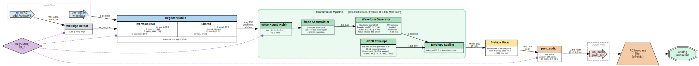

# Triple SID Voice Synthesizer (TT-IHP)

Three time-multiplexed SID voices with ADSR envelopes, controlled via a
flat parallel register interface, with 8-bit PWM audio output. Designed
for a Tiny Tapeout 1x1 tile on the IHP SG13G2 130nm process at 50 MHz.

[View the GDS layout](https://rrrh.github.io/tiny_sid_chip/)

---

## Table of Contents

1. [Overview](#overview)
2. [Architecture](#architecture)
3. [Pin Mapping](#pin-mapping)
4. [Register Reference](#register-reference)
5. [Write Interface Protocol](#write-interface-protocol)
6. [Audio Output and PWM](#audio-output-and-pwm)
7. [Audio Recovery Filter](#audio-recovery-filter)
8. [Usage Guide](#usage-guide)
9. [Design Constraints](#design-constraints)

---

## Overview

This design implements a triple-voice sound synthesizer inspired by the
MOS 6581/8580 SID chip from the Commodore 64. Three independent voices
share a single compute pipeline via time-multiplexing, each providing
four classic waveform types (sawtooth, triangle, pulse, noise), a full
ADSR amplitude envelope, and waveform OR-combining -- all packed into a
Tiny Tapeout 1x1 tile.

A host microcontroller (Arduino, RP2040, ESP32, etc.) writes per-voice
control registers through a simple flat parallel interface using 8-bit
data and a rising-edge write strobe. The three voice outputs are mixed
and output as an 8-bit PWM signal on `uo_out[0]` at ~196 kHz, requiring
only a passive second-order RC low-pass filter to produce analog audio.

### Key Features

- Three independent voices, time-multiplexed through one shared pipeline
- Four waveforms per voice: sawtooth, triangle, pulse (variable width), noise
- OR-combining of simultaneous waveforms (matches real SID behavior)
- 4-bit linear ADSR envelope per voice (16 amplitude levels)
- 13 envelope rate settings from ~1.3 ms to ~3.4 s full traverse
- 16-bit frequency registers with /16 prescaler (~15.9 Hz resolution)
- 3-voice mixer with automatic level scaling
- 8-bit PWM audio output (~196 kHz carrier at 50 MHz)
- Flat parallel write interface (no SPI/I2C overhead)
- Single 50 MHz clock domain, no PLLs or clock enables
- Fits in a Tiny Tapeout 1x1 tile on IHP SG13G2 130nm

### Source Files

| File | Description |
|------|-------------|
| `src/tt_um_sid.v` | All-in-one top-level: register banks, voice pipeline, mixer, pin mapping |
| `src/pwm_audio.v` | 8-bit PWM audio output (255-clock period) |

---

## Architecture



<details><summary>ASCII fallback</summary>

```
                 ┌─────────────────────────────────────────────────────────────┐
 ui_in[2:0] ──┐  │              Shared Voice Pipeline (×3 TDM)                │
 ui_in[4:3] ──┤  │  ┌─────────┐  ┌───────────┐  ┌──────────┐  ┌──────────┐  │
 ui_in[7]   ──┤  │  │ Phase   │  │ Waveform  │  │  ADSR    │  │ Envelope │  │
              ├──┤  │ Acc     │──│ Gen       │──│ Envelope │──│ Scaling  │──┤
 uio_in ──────┤  │  │ (16-bit)│  │(saw/tri/  │  │(4-bit    │  │ (8×4=12) │  │  ┌───────┐  ┌─────────┐
              │  │  │ +/16    │  │ pulse/    │  │ per      │  │          │  ├──│ Mixer │──│pwm_audio│── uo_out[0]
 Register     │  │  │ prescale│  │ noise)    │  │ voice)   │  │          │  │  │ (>>2) │  │ (8-bit) │
 Banks        │  │  └─────────┘  └──────────┘  └──────────┘  └──────────┘  │  └───────┘  └─────────┘
 (per-voice   │  │                                                          │
  freq/PW/    │  │  vidx: 0→1→2→0→… @ 50 MHz                              │
  waveform +  │  └─────────────────────────────────────────────────────────────┘
  shared ADSR)│
              │
```

</details>

**Signal flow:**

1. The host writes per-voice registers (frequency, pulse width, waveform)
   and shared ADSR registers (attack/decay, sustain/release) via the
   flat parallel interface. A rising edge on `ui_in[7]` latches the data.

2. A 2-bit round-robin counter (`vidx`) cycles 0→1→2→0 every clock at
   50 MHz, selecting which voice's state is processed. Each voice is
   updated every 3 clocks (16.67 MHz effective per voice).

3. A shared 4-bit accumulator prescaler divides the phase update rate
   by 16, so each voice's 16-bit accumulator advances at ~1.042 MHz.
   This provides ~15.9 Hz frequency resolution with 16-bit registers.

4. The waveform generator derives sawtooth, triangle, pulse, and noise
   outputs from the accumulator state and a shared 4-bit LFSR. Selected
   waveforms are OR-combined into an 8-bit value, then multiplied by
   the 4-bit ADSR envelope to produce a 12-bit voice output.

5. The mixer accumulates three voice outputs over 3 clocks, shifts right
   by 2, and outputs an 8-bit mix sample to the PWM module.

6. `pwm_audio` converts the 8-bit mix sample into a PWM signal at
   ~196 kHz. An external RC low-pass filter recovers analog audio.

---

## Pin Mapping

### Input Pins (`ui_in`)

| Pin | Signal | Description |
|-----|--------|-------------|
| `ui_in[2:0]` | `reg_addr` | Register address (0--6) |
| `ui_in[4:3]` | `voice_sel` | Voice select: 0=voice 1, 1=voice 2, 2=voice 3 |
| `ui_in[6:5]` | -- | Unused |
| `ui_in[7]` | `wr_en` | Write enable (rising-edge triggered) |

### Data Input Pins (`uio_in`)

| Pin | Signal | Description |
|-----|--------|-------------|
| `uio_in[7:0]` | `wr_data` | 8-bit write data. All 8 pins are inputs. |

### Output Pins (`uo_out`)

| Pin | Signal | Description |
|-----|--------|-------------|
| `uo_out[0]` | `pwm_out` | PWM audio output. Connect to RC filter. |
| `uo_out[7:1]` | -- | Tied low. |

### Bidirectional Pin Direction

All `uio` pins are configured as inputs (`uio_oe = 0x00`).

---

## Register Reference

Six registers per voice (address 3 is reserved). The 16-bit frequency
value is split into low/high byte pairs at addresses 0 and 1.
Attack/sustain registers are shared across all voices.

### Register 0: Frequency Low Byte

```
Bit:   7    6    5    4    3    2    1    0
     [              frequency[7:0]            ]
```

### Register 1: Frequency High Byte

```
Bit:   7    6    5    4    3    2    1    0
     [             frequency[15:8]            ]
```

The combined 16-bit frequency is the phase accumulator increment. The
accumulator advances at an effective rate of 50 MHz / 3 voices / 16
(prescaler) = 1.042 MHz per voice. The oscillator frequency is:

```
f_out = frequency_reg * 1041667 / 65536
```

**Frequency calculation:**

```
frequency_reg = round(desired_Hz * 65536 / 1041667)
              ≈ desired_Hz * 0.06291
```

| Frequency Register | Output Frequency | Note |
|---------------------|-----------------|------|
| 0x0000 | 0 Hz | Silence |
| 0x0004 | ~63.6 Hz | C2 (approx) |
| 0x0010 | ~254.3 Hz | ~C4 |
| 0x001C | ~444.9 Hz | ~A4 |
| 0xFFFF | ~1.04 MHz | Maximum (ultrasonic) |

### Register 2: Pulse Width (8-bit)

```
Bit:   7    6    5    4    3    2    1    0
     [             pulse_width[7:0]           ]
```

Sets the pulse waveform duty cycle by comparison with the accumulator
upper byte (`acc[15:8] > pulse_width`):

- `pw = 0x00`: Pulse always low (silent)
- `pw = 0x80`: 50% duty cycle (square wave)
- `pw = 0xFF`: Pulse almost always high (near DC)

### Register 4: Attack / Decay Rates (8-bit, shared)

```
Bit:   7    6    5    4    3    2    1    0
     [  decay_rate[3:0]  ][ attack_rate[3:0] ]
```

| Field | Bits | Description |
|-------|------|-------------|
| `attack_rate` | `[3:0]` | How fast the envelope rises from 0 to 15 |
| `decay_rate` | `[7:4]` | How fast the envelope falls from 15 to sustain level |

This register is shared across all three voices.

### Register 5: Sustain Level / Release Rate (8-bit, shared)

```
Bit:   7    6    5    4    3    2    1    0
     [ release_rate[3:0] ][sustain_level[3:0]]
```

| Field | Bits | Description |
|-------|------|-------------|
| `sustain_level` | `[3:0]` | Sustain amplitude (0--15). The envelope holds at this level during sustain. |
| `release_rate` | `[7:4]` | How fast the envelope falls to 0 after gate off |

This register is shared across all three voices.

### Register 6: Waveform Control (8-bit, per-voice)

```
Bit:   7      6      5        4        3     2     1     0
     [noise][pulse][sawtooth][triangle][test][ring][sync][gate]
```

| Bit | Name | Description |
|-----|------|-------------|
| 0 | `gate` | Set to 1 to start a note (attack). Clear to 0 to release. |
| 1 | `sync` | Reserved (no effect in current design). |
| 2 | `ring` | Reserved (no effect in current design). |
| 3 | `test` | Forces oscillator accumulator to 0 while held. |
| 4 | `triangle` | Enable triangle waveform. |
| 5 | `sawtooth` | Enable sawtooth waveform. |
| 6 | `pulse` | Enable pulse waveform (duty cycle set by reg 2). |
| 7 | `noise` | Enable noise waveform (shared 4-bit LFSR). |

When multiple waveform bits are set, their outputs are bitwise
OR-combined (matching real SID behavior).

### Envelope Rate Table

The ADSR uses an 18-bit free-running prescaler. Each rate value selects
which prescaler bits must all be 1 for an envelope tick. The 4-bit
envelope counter steps by 1 per tick, so a full 0→15 traverse takes
16 ticks.

| Rate | Prescaler Period | Full Traverse (16 steps) |
|------|------------------|--------------------------|
| 0 | 2^6 = 64 clocks | ~20.5 us |
| 1 | 2^7 = 128 | ~41 us |
| 2 | 2^8 = 256 | ~82 us |
| 3 | 2^9 = 512 | ~164 us |
| 4 | 2^10 = 1024 | ~328 us |
| 5 | 2^11 = 2048 | ~655 us |
| 6 | 2^12 = 4096 | ~1.3 ms |
| 7 | 2^13 = 8192 | ~2.6 ms |
| 8 | 2^14 = 16384 | ~5.2 ms |
| 9 | 2^15 = 32768 | ~10.5 ms |
| 10 | 2^16 = 65536 | ~21 ms |
| 11 | 2^17 = 131072 | ~42 ms |
| 12--15 | 2^18 = 262144 | ~84 ms |

Formula: `traverse_time = 16 * 2^(rate+6) / 50000000` seconds.

---

## Write Interface Protocol

The register interface uses a simple parallel bus with rising-edge write
strobe. No SPI or I2C protocol is needed.

### Write Sequence

To write one register:

1. Set `ui_in[2:0]` = register address (0--6)
2. Set `ui_in[4:3]` = voice select (0, 1, or 2)
3. Set `uio_in[7:0]` = data byte
4. Pulse `ui_in[7]` high for at least one clock cycle
5. Return `ui_in[7]` low before the next write

The register latches on the rising edge of `ui_in[7]`. The minimum write
cycle is 3 clock cycles (60 ns at 50 MHz): one to set up address/data,
one with WE high, one with WE low.

### Timing Diagram

```
            ┌───────┐                         ┌───────┐
  ui_in[7]  │       │                         │       │
 ───────────┘       └─────────────────────────┘       └─────
                ^                                 ^
          write latched                     write latched

  ui_in[4:0]  <  voice | addr  >             < voice | addr  >

  uio_in      <    data byte   >             <  data byte    >
```

### Write Function (C / Arduino)

```c
// Write an 8-bit value to a SID register
// addr: 0-6, voice: 0-2, data: 0-255
void sid_write(uint8_t addr, uint8_t data, uint8_t voice) {
    uint8_t ui = (addr & 0x07) | ((voice & 0x03) << 3);
    set_ui_in(ui);           // address + voice, WE=0
    set_uio_in(data);        // data byte
    set_ui_in(ui | 0x80);    // assert WE (rising edge triggers write)
    set_ui_in(ui);           // deassert WE
}

// Write a 16-bit frequency
void sid_write_freq(uint16_t freq, uint8_t voice) {
    sid_write(0, freq & 0xFF, voice);
    sid_write(1, (freq >> 8) & 0xFF, voice);
}
```

---

## Audio Output and PWM

### How It Works

The `pwm_audio` module converts the 8-bit mixer output into a
pulse-width modulated signal. A free-running 8-bit counter cycles from
0 to 254 (period = 255 clocks). The output is high when the counter is
less than the sample value:

```
pwm_out = (count < sample) ? 1 : 0
```

### Signal Characteristics

| Parameter | Value |
|-----------|-------|
| Input resolution | 8 bits (unsigned, 0--255) |
| Output | 1-bit PWM on `uo_out[0]` |
| PWM period | 255 clocks |
| PWM frequency @ 50 MHz | ~196 kHz |
| Duty cycle range | 0% (sample=0) to 100% (sample=255) |
| Audio bandwidth | Full 20 kHz+ (Nyquist ~98 kHz) |

---

## Audio Recovery Filter

The PWM output on `uo_out[0]` swings between 0 and VDD. A second-order
passive RC low-pass filter recovers the analog audio signal.

### Recommended Circuit

```
uo_out[0] ---[R1]---+---[R2]---+---[Cac]---> Audio Out
                     |          |
                    [C1]       [C2]
                     |          |
                    GND        GND
```

### Component Values

| R (per stage) | C (per stage) | Per-stage fc | Actual -3 dB | @ 196 kHz |
|---------------|---------------|-------------|-------------|-----------|
| 3.3 kOhm | 1 nF | 48.2 kHz | ~18 kHz | -28 dB |

- **Cac** = 1 uF ceramic -- DC blocking capacitor after the filter.
- For driving low-impedance loads (headphones), add a unity-gain op-amp
  buffer after the filter.

---

## Usage Guide

### Minimal Wiring

```
MCU                    TT Chip                   Audio
-----------           ----------------          -------
GPIO (D0)   --------> ui_in[0]  addr[0]
GPIO (D1)   --------> ui_in[1]  addr[1]
GPIO (D2)   --------> ui_in[2]  addr[2]
GPIO (D3)   --------> ui_in[3]  voice[0]
GPIO (D4)   --------> ui_in[4]  voice[1]
GPIO (WE)   --------> ui_in[7]  write enable
GPIO (D5-12)--------> uio_in[7:0]  data bus
                       uo_out[0] ----[3.3k]---+---[3.3k]---+---[1uF]---> amp
                                               |            |
                                             [1nF]        [1nF]
                                               |            |
                                              GND          GND
```

### Playing a Note (Voice 0, Sawtooth 440 Hz)

```c
// freq_reg = 440 * 0.06291 ≈ 28
sid_write(0, 28, 0);     // freq_lo = 28
sid_write(1, 0, 0);      // freq_hi = 0
sid_write(4, 0x00, 0);   // attack=0 (fastest), decay=0
sid_write(5, 0x0F, 0);   // sustain=15 (max), release=0
sid_write(6, 0x21, 0);   // sawtooth + gate ON

delay(500);              // hold note for 500 ms

sid_write(6, 0x20, 0);   // gate OFF (release begins)
```

### Three-Voice Chord (C Major)

```c
// C4 ≈ 262 Hz → freq_reg ≈ 16
sid_write(0, 16, 0);  sid_write(1, 0, 0);
sid_write(4, 0x00, 0); sid_write(5, 0x0F, 0);
sid_write(6, 0x21, 0);  // Voice 0: sawtooth C4

// E4 ≈ 330 Hz → freq_reg ≈ 21
sid_write(0, 21, 1);  sid_write(1, 0, 1);
sid_write(6, 0x11, 1);  // Voice 1: triangle E4

// G4 ≈ 392 Hz → freq_reg ≈ 25
sid_write(0, 25, 2);  sid_write(1, 0, 2);
sid_write(2, 0x80, 2);  // pulse width = 50%
sid_write(6, 0x41, 2);  // Voice 2: pulse G4
```

### Sound Recipes

#### Simple Square Wave (8-bit Game Style)

```c
sid_write(0, freq_lo, v); sid_write(1, freq_hi, v);
sid_write(2, 0x80, v);    // 50% duty cycle
sid_write(4, 0x00, v);    // instant attack/decay
sid_write(5, 0x0F, v);    // max sustain, instant release
sid_write(6, 0x41, v);    // pulse + gate
```

#### Drum Hit (Noise with Fast Decay)

```c
sid_write(0, 0xFF, v); sid_write(1, 0xFF, v);  // high freq noise
sid_write(4, 0xA0, v);    // instant attack, rate-10 decay
sid_write(5, 0xA0, v);    // sustain=0, rate-10 release
sid_write(6, 0x81, v);    // noise + gate
// Naturally decays to silence
```

#### Pad (Triangle with Slow Envelope)

```c
sid_write(0, freq_lo, v); sid_write(1, freq_hi, v);
sid_write(4, 0x8A, v);    // attack=10 (~21ms), decay=8 (~5ms)
sid_write(5, 0x8C, v);    // sustain=12, release=8
sid_write(6, 0x11, v);    // triangle + gate
```

### Frequency Table (Equal Temperament, A4=440 Hz)

```
freq_reg = round(Hz * 65536 / 1041667)
```

| Note | Hz | freq_reg | hex |
|------|----|----------|-----|
| C2 | 65.4 | 4 | 0x0004 |
| C3 | 130.8 | 8 | 0x0008 |
| C4 | 261.6 | 16 | 0x0010 |
| E4 | 329.6 | 21 | 0x0015 |
| G4 | 392.0 | 25 | 0x0019 |
| A4 | 440.0 | 28 | 0x001C |
| C5 | 523.3 | 33 | 0x0021 |
| C6 | 1046.5 | 66 | 0x0042 |
| C7 | 2093.0 | 132 | 0x0084 |
| C8 | 4186.0 | 263 | 0x0107 |

### Reset and Initialization

After power-on or chip reset (`rst_n` asserted low), all registers are
cleared to zero. All voices are silent. No initialization sequence is
required.

To silence the output at any time:
- Clear the gate bit: `sid_write(6, waveform & 0xFE, voice)`
- Set frequency to 0: `sid_write(0, 0, v); sid_write(1, 0, v)`
- Set the test bit: `sid_write(6, 0x08, v)`

---

## Design Constraints

| Parameter | Value |
|-----------|-------|
| Target technology | IHP SG13G2 130nm SiGe BiCMOS |
| Tile size | Tiny Tapeout 1x1 |
| Core supply (VDD) | 1.2V |
| I/O supply (VDDIO) | 3.3V |
| System clock | 50 MHz (20 ns period) |
| Core utilization | ~82% |
| Voice count | 3 (time-multiplexed) |
| Frequency resolution | ~15.9 Hz (16-bit acc + /16 prescaler) |
| Envelope depth | 4-bit (16 levels) |
| PWM output frequency | ~196 kHz |
| Audio bandwidth | 20 kHz+ (Nyquist ~98 kHz) |
| Write interface speed | 1 register per 60 ns (3 clocks) |
