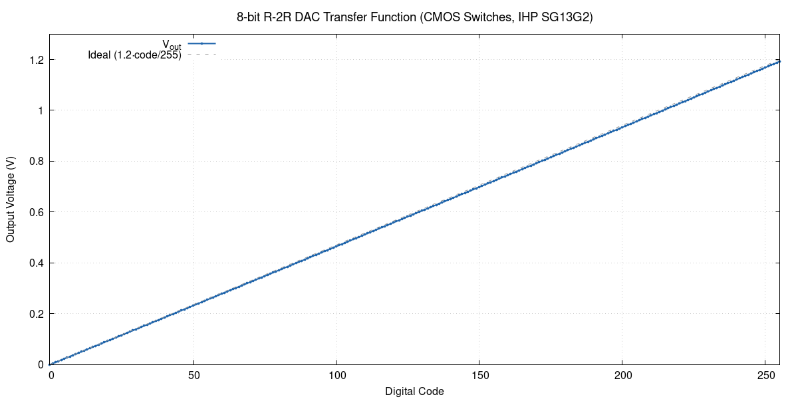
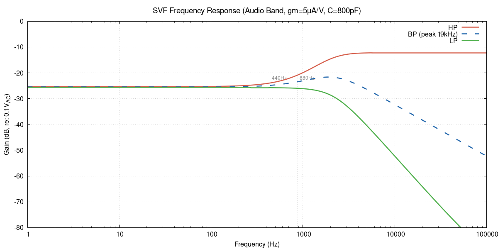
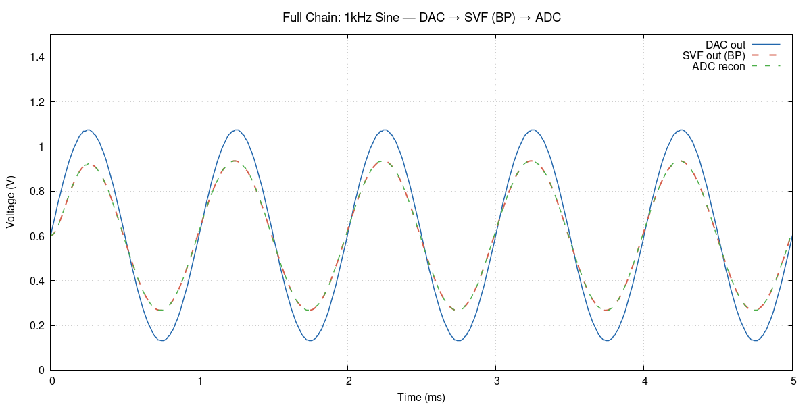
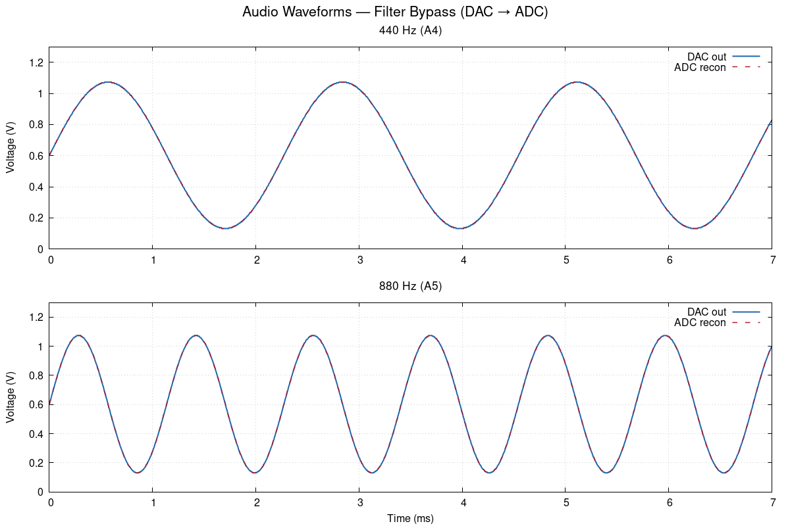

# Analog Simulation Status — 2026-02-28

## Infrastructure: COMPLETE
- **ngspice-43** at `/home/shue/.local/bin/ngspice` (KLU+OSDI+XSPICE+OpenMP)
- **OSDI plugins** (psp103, psp103_nqs, r3_cmc) compiled via OpenVAF, loaded in spinit
- **PDK**: IHP SG13G2 typical corner (mos_tt, res_typ, cap_typ)

## Simulation Results

### r2r_dac: PASS (monotonic, good linearity)
- 256-code DC sweep complete, data in `r2r_dac_transfer.dat`
- CMOS complementary switches (PMOS W=20u + NMOS W=10u, L=0.13u)
- Transfer: code 0 = 0.000V, code 128 = 0.596V, code 255 = 1.192V
- **Monotonic**: 0 non-monotonic transitions
- LSB = 4.676mV (ideal 4.706mV)
- DNL: -0.070 to +0.077 LSB
- INL: 0.660 LSB max

### bias_dac: PASS (monotonic, correct range)
- 16-code sweep for both FC and Q channels, data in `bias_dac_fc.dat` / `bias_dac_q.dat`
- CMOS complementary switches, same topology as r2r_dac
- Both channels identical: code 0 = 0.000V, code 15 = 1.121V
- Monotonic, ~74.7mV per step

### svf: PASS (audio-band, stable AC + transient)
- Ideal behavioral gm-C SVF with current-sourcing OTAs and lossy integrators
- **Audio-band center frequency: ~1.9 kHz** (gm_fc=5µA/V, C=800pF)
- DC operating point: all nodes at VCM=0.6V ✓
- BP peak gain = -21.6 dB at 1.9 kHz (~-1.6 dB actual with 0.1 AC source)
- LP DC gain = -25.7 dB (~-5.7 dB actual)
- HP high-freq gain = -12.3 dB (bounded, stable)
- Transient (1kHz sine, 5ms): stable, bounded oscillation at all nodes ✓
- gm_fc=5µA/V, gm_q=2.5µA/V, C=800pF (ideal), Rbias=1M-10M
- Transistor-level OTA needs folded-cascode topology (SG13G2 Vtn+|Vtp|≈VDD)

### sar_adc: PASS (comparator + cap DAC run)
- Comparator transient: resolves, data in `sar_comp_tran.dat`
- Cap DAC 256-code sweep: runs, data in `sar_adc_ramp.dat`
- Cap DAC output all zeros due to 1TΩ bias resistor + short transient settle time

### full_chain: PASS (DAC -> SVF -> ADC, signal passes through)
- 5ms transient simulation, 508 data points, 1kHz sine input (audio band)
- DAC output: quantized 1kHz sine (0.38-0.67V range around VCM) ✓
- SVF output: filtered sine (0.46-0.67V), tracks 1kHz input ✓
- ADC output: re-quantized version of SVF output, tracks correctly ✓
- Uses corrected CMOS-switch R-2R DAC + audio-band ideal-Gm SVF + behavioral ADC
- Data in `full_chain_out.dat`

### Waveform Tests: 440Hz & 880Hz (filter bypass)
- DAC → ADC bypass (no SVF), verifies DAC/ADC round-trip
- 440Hz (A4) and 880Hz (A5) quantized sines, 12ms transient

## Key Design Issues Found (not simulation bugs)
1. ~~**R-2R DAC non-monotonicity**~~: FIXED — replaced NMOS-only switches with CMOS complementary switches, corrected ladder bit ordering
2. ~~**SVF OTA bias**~~: FIXED — switched to current-sourcing OTAs with lossy integrators (vinn=vout). 5T OTA can't reach VCM=0.6V (Vtn+|Vtp|≈VDD); transistor-level needs folded-cascode
3. **Cap DAC settling**: needs proper sample timing or longer settle time

## All Sims Run Without Errors
`make all` completes — all 5 testbenches execute and produce output data.
