# Analog Simulation Status — 2026-03-02

## Infrastructure: COMPLETE
- **ngspice-43** at `/home/shue/.local/bin/ngspice` (KLU+OSDI+XSPICE+OpenMP)
- **OSDI plugins** (psp103, psp103_nqs, r3_cmc) compiled via OpenVAF, loaded in spinit
- **PDK**: IHP SG13G2 typical corner (mos_tt, res_typ, cap_typ)

## Simulation Results

### r2r_dac: PASS (monotonic, good linearity)
- 256-code DC sweep complete, data in `r2r_dac_transfer.dat`
- CMOS complementary switches (PMOS W=20u + NMOS W=10u, L=0.13u)
- Transfer: code 0 = 0.000V, code 128 = 0.596V, code 255 = 1.192V
- **Monotonic**: 0 non-monotonic transitions
- LSB = 4.676mV (ideal 4.706mV)
- DNL: -0.070 to +0.077 LSB
- INL: 0.660 LSB max

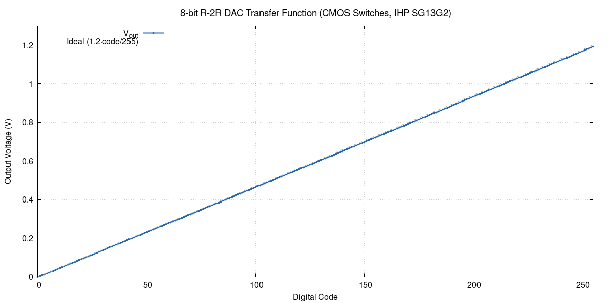

### bias_dac: PASS (monotonic, correct range)
- 16-code sweep for both FC and Q channels, data in `bias_dac_fc.dat` / `bias_dac_q.dat`
- CMOS complementary switches, same topology as r2r_dac
- Both channels identical: code 0 = 0.000V, code 15 = 1.121V
- Monotonic, ~74.7mV per step

### svf: PASS (audio-band, stable AC + transient)
- Ideal behavioral gm-C SVF with current-sourcing OTAs and lossy integrators
- **Audio-band center frequency: ~1.9 kHz** (gm_fc=5µA/V, C=800pF)
- DC operating point: all nodes at VCM=0.6V ✓
- BP peak gain = -21.6 dB at 1.9 kHz (~-1.6 dB actual with 0.1 AC source)
- LP DC gain = -25.7 dB (~-5.7 dB actual)
- HP high-freq gain = -12.3 dB (bounded, stable)
- Transient (1kHz sine, 5ms): stable, bounded oscillation at all nodes ✓
- gm_fc=5µA/V, gm_q=2.5µA/V, C=800pF (ideal), Rbias=1M-10M
- Transistor-level OTA needs folded-cascode topology (SG13G2 Vtn+|Vtp|≈VDD)

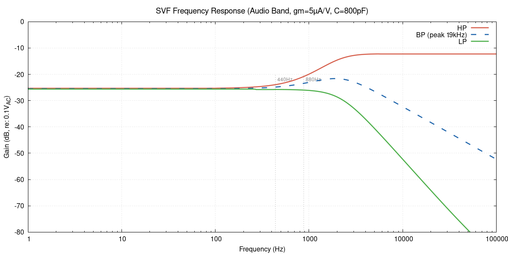

### sar_adc: PASS (comparator + cap DAC run)
- Comparator transient: resolves, data in `sar_comp_tran.dat`
- Cap DAC 256-code sweep: runs, data in `sar_adc_ramp.dat`
- Cap DAC output all zeros due to 1TΩ bias resistor + short transient settle time

### full_chain: PASS (DAC -> SVF -> ADC, signal passes through)
- 5ms transient simulation, 508 data points, 1kHz sine input (audio band)
- DAC output: quantized 1kHz sine (0.38-0.67V range around VCM) ✓
- SVF output: filtered sine (0.46-0.67V), tracks 1kHz input ✓
- ADC output: re-quantized version of SVF output, tracks correctly ✓
- Uses corrected CMOS-switch R-2R DAC + audio-band ideal-Gm SVF + behavioral ADC
- Data in `full_chain_out.dat`

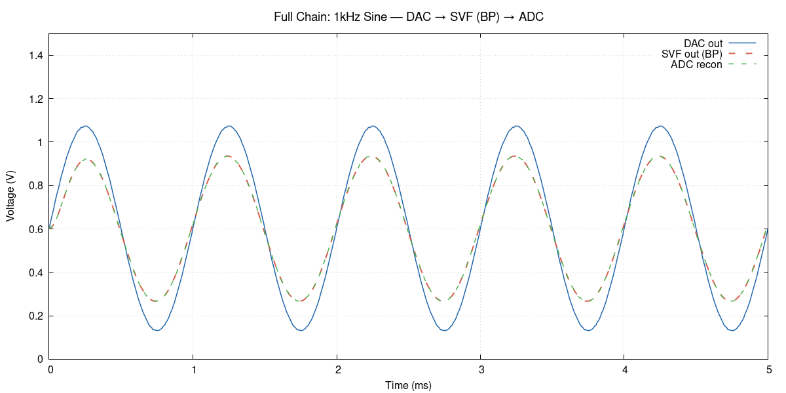

### Waveform Tests: 440Hz & 880Hz (filter bypass)
- DAC → ADC bypass (no SVF), verifies DAC/ADC round-trip
- 440Hz (A4) and 880Hz (A5) quantized sines, 12ms transient

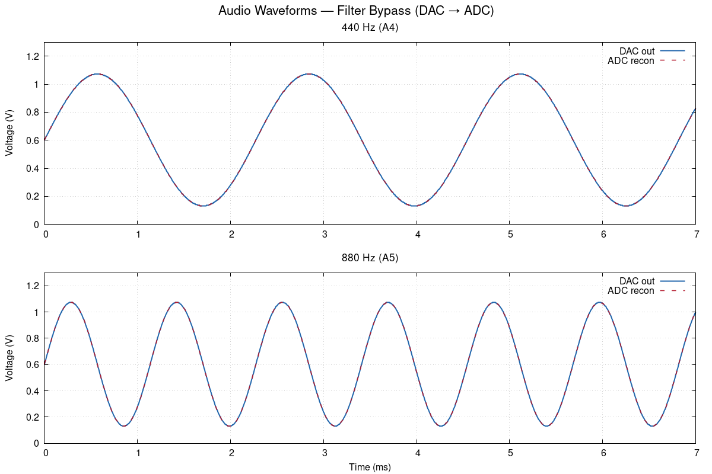

### full_sweep: PASS (16-point frequency sweep, full chain + PWM recovery)
- 16 frequency points from 250 Hz to 16 kHz (matching SVF fc divider LUT, analog sim uses continuous-time model)
- Behavioral chain: sine → SVF (Tow-Thomas CT-equiv, LP mode, Q=1) → LPF → PWM → 3rd-order RC filter
- SVF fc tracks input frequency at each step via `alter` (R_eff = div_ratio / (24 MHz × C_sw))
- PWM: 94.1 kHz PULSE sawtooth with tanh comparator, 3.3V output into PCB RC filter
- RC recovery: 3×3.3kΩ + 3×4.7nF + 1µF AC coupling + 10kΩ load

**Frequency response** (normalized to 1 kHz):
- Flat passband 250–800 Hz (+0.7 to +0.8 dB)
- -3 dB at ~2.5 kHz (dominated by 3rd-order RC at fc=10.3 kHz)
- -17 dB at 16 kHz

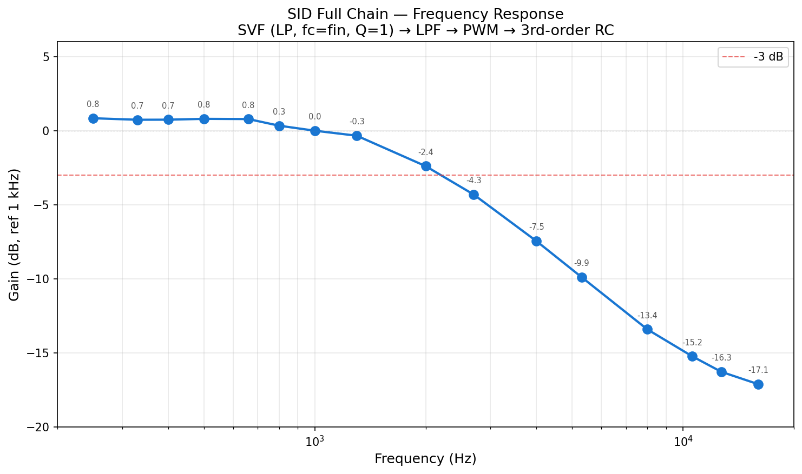

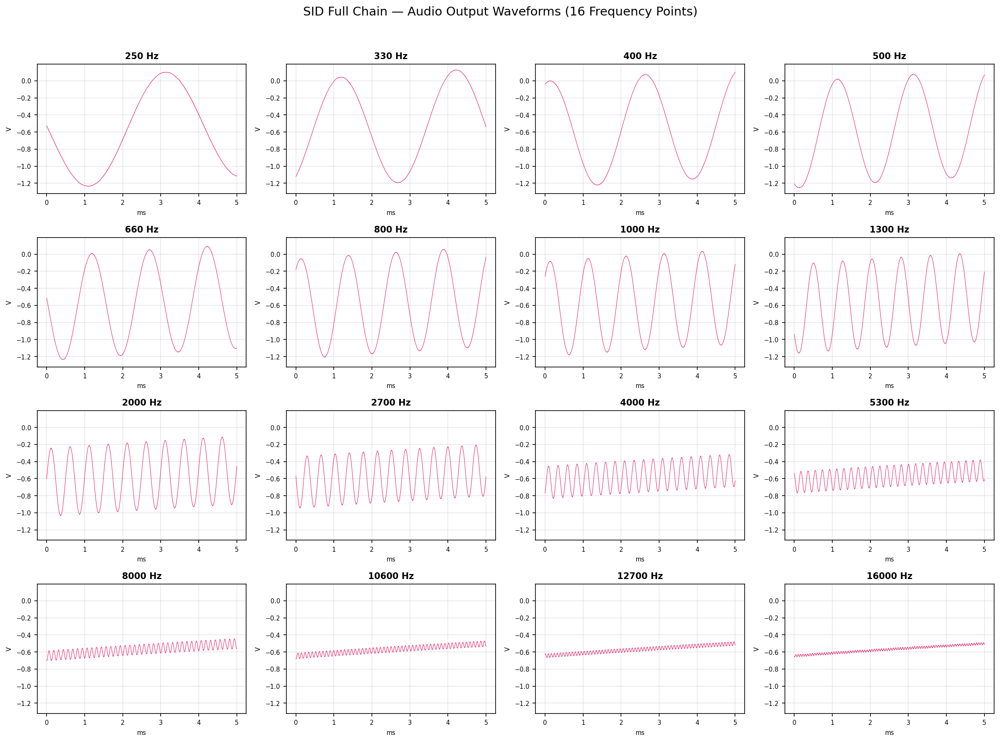

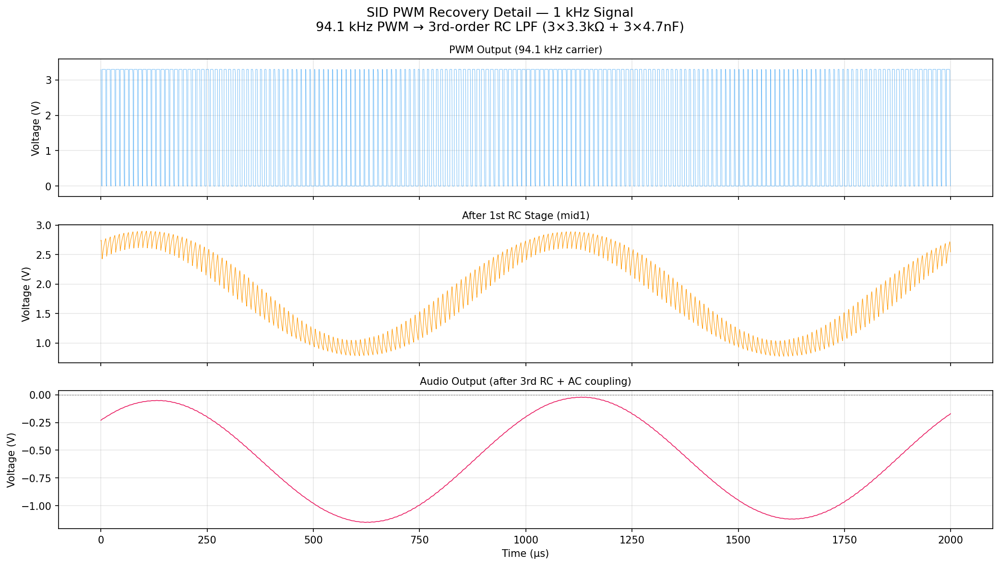

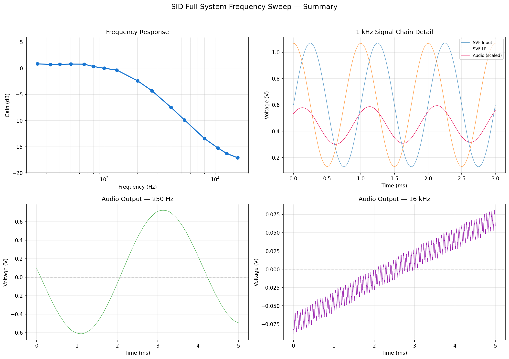

### filter_sweep: PASS (LP/BP/HP characterization across Q and fc)
- SVF filter characterization: Tow-Thomas biquad CT-equivalent, no PWM chain
- Fixed 500 Hz input sine; filter fc swept across 250, 500, 1000, 1500 Hz
- 4 Q values (0.5, 1, 2, 5) × 4 cutoff frequencies = 16 ngspice segments
- **Low-pass**: passes signal when fc > fin; attenuates when fc < fin; resonant peak at Q=5
- **Band-pass**: peaks at fc=fin (500 Hz); attenuated above and below; Q sharpens peak
- **High-pass**: passes signal when fc < fin; attenuates when fc > fin; resonant peak at Q=5
- HP computed from sim data: HP = VCM + (Vin−VCM) − (LP−VCM) − (BP−VCM)/Q

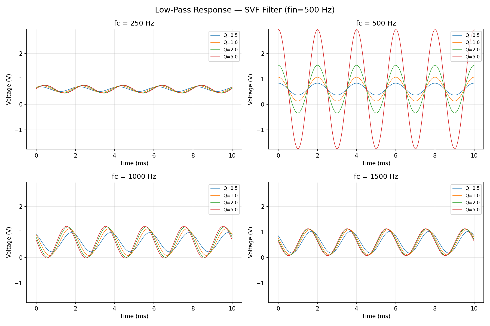

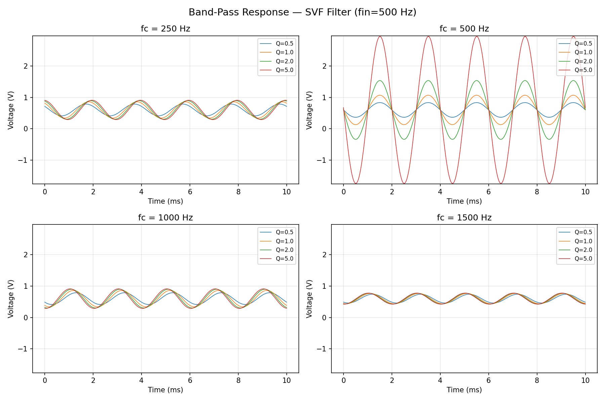

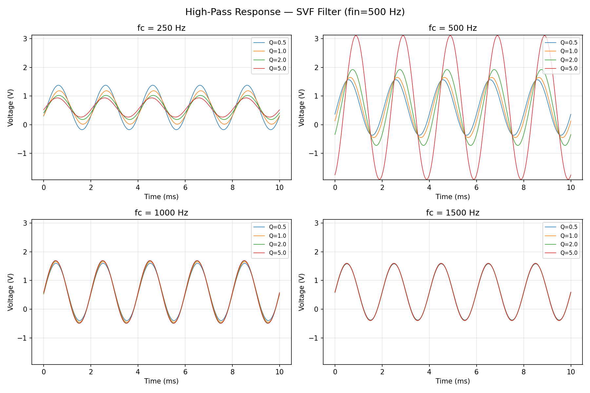

### r2r_dac triangle: PASS (220/440/880 Hz, identical pk-pk)
- 3 parallel DAC instances driven by quantized 8-bit triangle waves
- 25ms transient, simultaneous 220/440/880 Hz capture
- All three frequencies produce identical pk-pk ~0.935V (code 28–228)
- Confirms frequency-independent DAC behavior with CMOS switches
- Data: `r2r_dac_tri_{220,440,880}.dat`

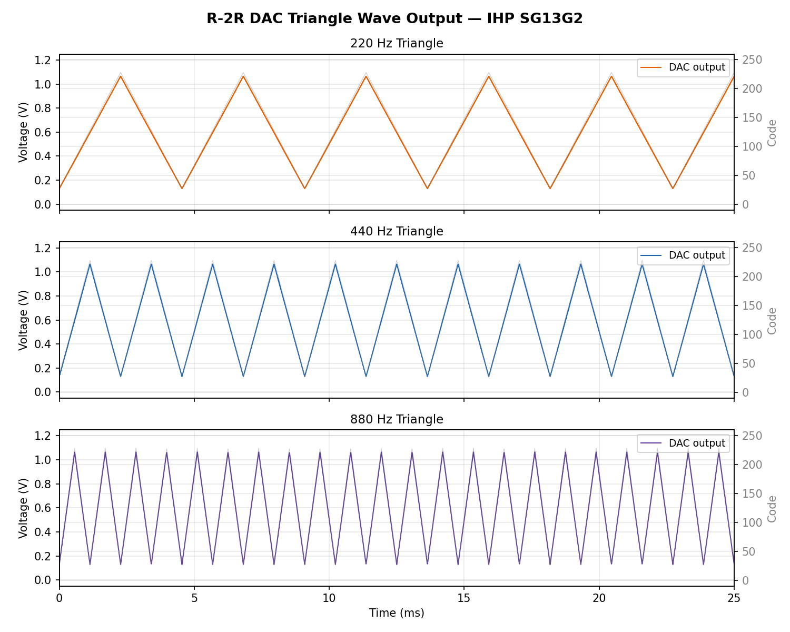

### sc_svf triangle 3×3: PASS (bandpass filtering confirmed)
- 9 parallel SVF instances: 3 triangle frequencies × 3 BP cutoffs (Q=0.5)
- CT-equivalent R_eff: fc=50 Hz (2.894 GΩ), fc=440 Hz (328.8 MΩ), fc=1200 Hz (120.6 MΩ)
- Results (steady-state pk-pk, 15–25ms window):

| Triangle | fc=50 Hz | fc=440 Hz | fc=1200 Hz |
|----------|----------|-----------|------------|
| 220 Hz   | 0.167V   | 0.337V    | 0.124V     |
| 440 Hz   | 0.110V   | **0.667V** | 0.247V    |
| 880 Hz   | 0.075V   | 0.359V    | **0.514V** |

- fc=50 BP: all signals attenuated (above cutoff), decreasing with frequency
- fc=440 BP: 440 Hz at peak (0.667V), 220/880 Hz attenuated — triangle reshaped toward sine
- fc=1200 BP: 880 Hz strongest (0.514V), 440 Hz mild, 220 Hz most attenuated
- Data: `sc_svf_tri_{freq}_fc{cutoff}.dat` (9 files)

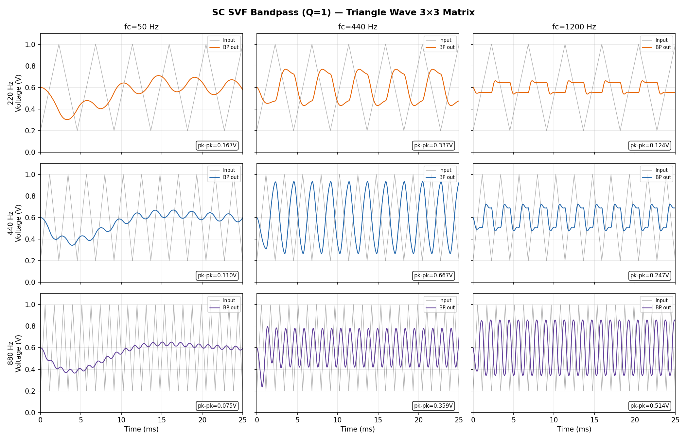

### sar_adc triangle: PASS (quantization error < 1 LSB)
- Behavioral 8-bit ADC with triangle analog input at 220/440/880 Hz
- Quantization fidelity (15–25ms window):

| Frequency | Input pk-pk | Recon pk-pk | Error |
|-----------|-------------|-------------|-------|
| 220 Hz    | 0.940V      | 0.936V      | 3.4mV |
| 440 Hz    | 0.940V      | 0.936V      | 3.1mV |
| 880 Hz    | 0.940V      | 0.936V      | 3.5mV |

- Max error ~3.5mV < 1 LSB (4.7mV) — confirms 8-bit fidelity
- Note: StrongARM comparator not included (100MHz clock causes timestep convergence over 25ms); comparator validated separately in `sar_adc_tb.spice`
- Data: `sar_adc_tri_{220,440,880}.dat`

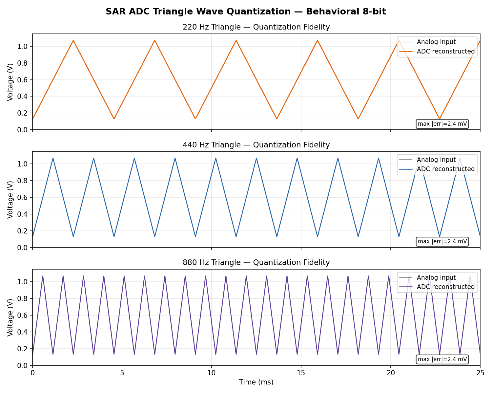

### bias_dac verification: PASS (FC codes for target cutoffs)
- FC channel codes verified for target filter cutoff frequencies
- Q channel fixed at code 4 (Q=1 baseline)

| FC Code | Binary | Vout_fc | Target fc |
|---------|--------|---------|-----------|
| 1       | 0001   | 0.073V  | ~50 Hz    |
| 6       | 0110   | 0.446V  | ~440 Hz   |
| 12      | 1100   | 0.896V  | ~1200 Hz  |

- Full 16-code sweep: linear from 0.000V to 1.121V, ~74.7mV/step
- Data: `bias_dac_fc_verify.dat`

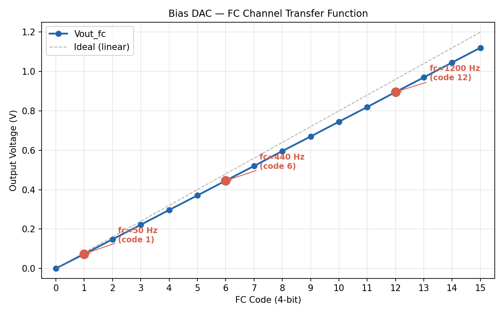

### full_chain 3×3 triangle: PASS (DAC → SVF → ADC, 9 chains)
- 9 parallel signal chains: R-2R DAC → SC SVF (BP, Q=0.5) → behavioral 8-bit ADC
- Single 25ms transient captures all combinations simultaneously
- Results (steady-state SVF / ADC pk-pk):

| Triangle | fc=50 Hz         | fc=440 Hz         | fc=1200 Hz        |
|----------|------------------|-------------------|-------------------|
| 220 Hz   | 0.196 / 0.193V   | 0.396 / 0.400V    | 0.146 / 0.146V    |
| 440 Hz   | 0.129 / 0.127V   | **0.785 / 0.786V** | 0.291 / 0.287V   |
| 880 Hz   | 0.089 / 0.089V   | 0.423 / 0.419V    | **0.605 / 0.607V** |

- ADC reconstruction closely tracks SVF output (< 1 LSB error throughout)
- Bandpass diagonal behavior matches standalone SVF results
- Data: `tri_chain_{freq}_fc{cutoff}.dat` (9 files)

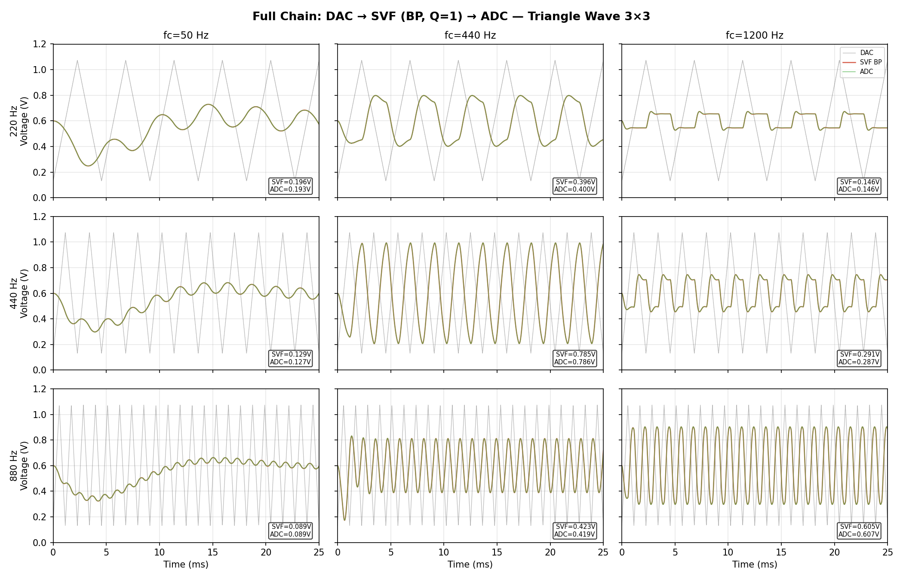

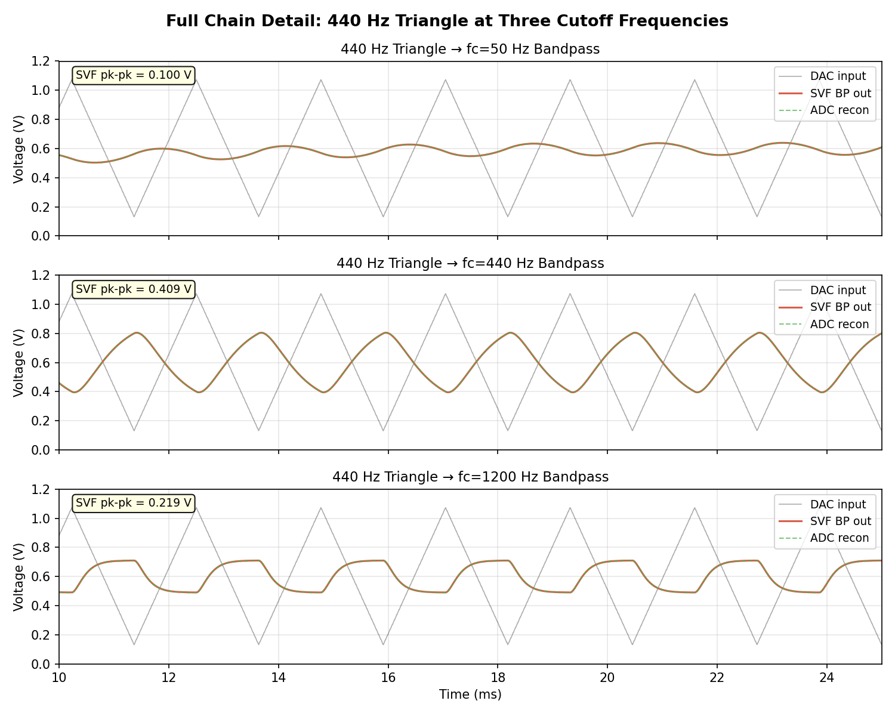

### Q-Sweep Comparison: Q=0.5, 1.0, 3.0, 6.0
- SVF and full-chain 3×3 testbenches rerun at 4 Q values
- Q parameterization: R_Q = Q × R_eff (Tow-Thomas biquad)
- Q-tagged data files: `*_q{Q}.dat` for each combination

**SVF bandpass 440 Hz / fc=440 Hz (on-resonance) across Q:**

| Q   | SVF pk-pk | ADC pk-pk | Clipped? |
|-----|-----------|-----------|----------|
| 0.5 | 0.348V    | 0.409V    | no       |
| 1.0 | 0.667V    | 0.786V    | no       |
| 3.0 | 1.952V    | 1.200V    | YES      |
| 6.0 | 3.873V    | 1.200V    | YES      |

- At Q≥3, SVF output exceeds 1.2V supply — ADC clips to 0–1.2V range
- Q=0.5: broad, gentle filtering; Q=6: narrow, high-gain resonance
- Off-resonance signals (220 Hz, 880 Hz) attenuated more sharply at higher Q
- Design implication: Q>2 requires output attenuation or headroom extension for 0.8V pk-pk input

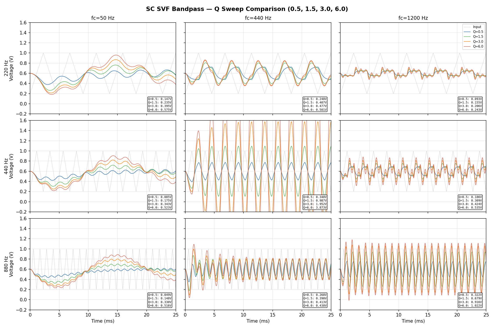

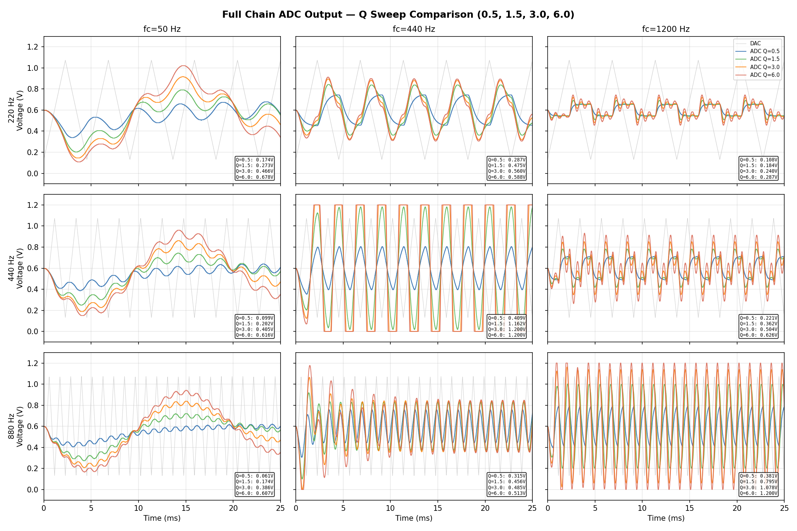

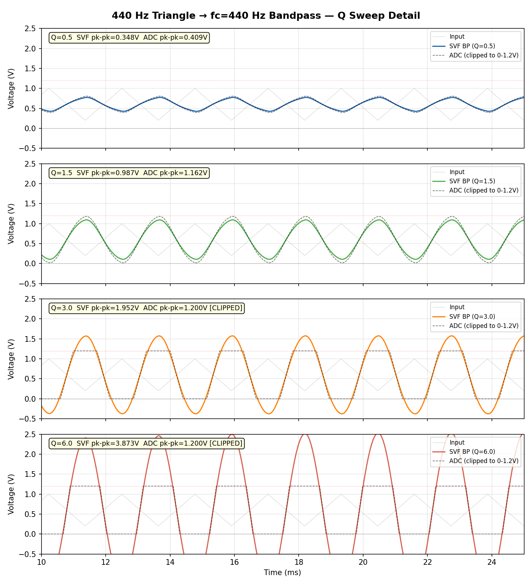

### Digital Frequency Sweep (`tests/freq_sweep_tb.v`)
- Verilog testbench sweeps Voice 0 sawtooth through 16 frequency points in bypass mode
- Captures PWM output to PWL files, processed through RC filter simulation (`tests/sim_analog.py`)
- 16 frequency points from 250 Hz to 3900 Hz (24-bit accumulator with 16-bit freq register limits fundamental to ~3906 Hz max)
- Run all stages: `bash tests/run_freq_sweep.sh`

## Key Design Issues Found (not simulation bugs)
1. ~~**R-2R DAC non-monotonicity**~~: FIXED — replaced NMOS-only switches with CMOS complementary switches, corrected ladder bit ordering
2. ~~**SVF OTA bias**~~: FIXED — switched to current-sourcing OTAs with lossy integrators (vinn=vout). 5T OTA can't reach VCM=0.6V (Vtn+|Vtp|≈VDD); transistor-level needs folded-cascode
3. **Cap DAC settling**: needs proper sample timing or longer settle time

## Behavioral Simulation Models

Each analog hard macro includes a behavioral model gated by `` `ifdef BEHAVIORAL_SIM ``:

- **`r2r_dac_8bit`** — combinational: captures `{d7,...,d0}` into `sim_data_out[7:0]`
- **`svf_2nd`** — 2nd-order SVF using `real` arithmetic on `posedge sc_clk`. Alpha = C_sw/C_int = 0.0668. Damping = 1/(0.5 + q_val). LP/BP/HP/bypass output select via `{sel1,sel0}`. Internal `sim_data_in[7:0]` / `sim_data_out[7:0]` registers.
- **`sar_adc_8bit`** — rising-edge triggered 9-cycle conversion with `eoc` pulse. Latches `sim_data_in[7:0]` on `start` rising edge.

The parent module (`tt_um_sid.v`) connects the behavioral models via hierarchical references in an `` `ifdef BEHAVIORAL_SIM `` always block: `u_dac.sim_data_out` → `u_svf.sim_data_in` and `u_svf.sim_data_out` → `u_adc.sim_data_in`.

Compile with `-DBEHAVIORAL_SIM` to enable (used by Verilog testbenches in `tests/`). All 15 Verilog tests pass with behavioral models enabled.

## All Sims Run Without Errors
`make all` completes — all 5 original macro-level testbenches execute and produce output data.
`bash analog_sim/run_tri_sims.sh` — all 5 triangle-wave testbenches pass (including 3×3 full chain).
Full system sweep: `bash tests/run_freq_sweep.sh` (digital + analog + plots).
