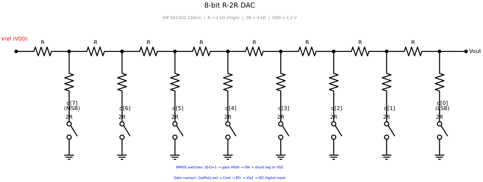
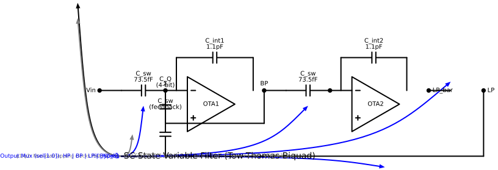
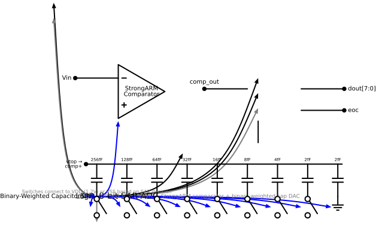
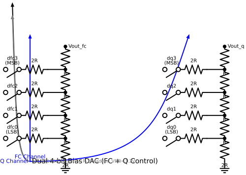
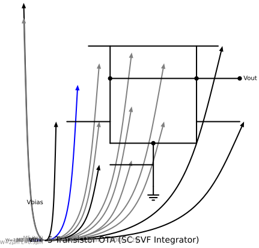
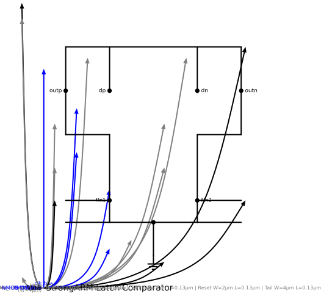

# Analog Circuit Schematics

Schematics for the four analog hard macros in the Rhesutron SID ASIC (IHP SG13G2 130nm, VDD=1.2V).

Generated with `docs/gen_analog_schematics.py` using [schemdraw](https://schemdraw.readthedocs.io/).

---

## 8-bit R-2R DAC

Complementary-switch R-2R ladder. R=2kΩ, 2R=4kΩ. Each bit steers its 2R leg to VDD or VSS.

---

## Switched-Capacitor State Variable Filter

2nd-order Tow-Thomas biquad. Two OTA integrators with MIM caps (C_int=1.1pF), SC resistors (C_sw=73.5fF), and a 4-bit binary-weighted C_Q array for Q tuning.

---

## 8-bit SAR ADC

Successive approximation ADC with a StrongARM latch comparator and binary-weighted capacitor DAC (2fF unit, 256fF MSB).

---

## Dual 4-bit Bias DAC

Two independent R-2R channels for filter frequency (FC) and resonance (Q) control.

---

## Transistor-Level Details

### 5-Transistor OTA

Simple differential pair with PMOS current mirror load, used in both SVF integrators.

### StrongARM Latch Comparator

Dynamic clocked comparator with cross-coupled CMOS latch, used in the SAR ADC.

