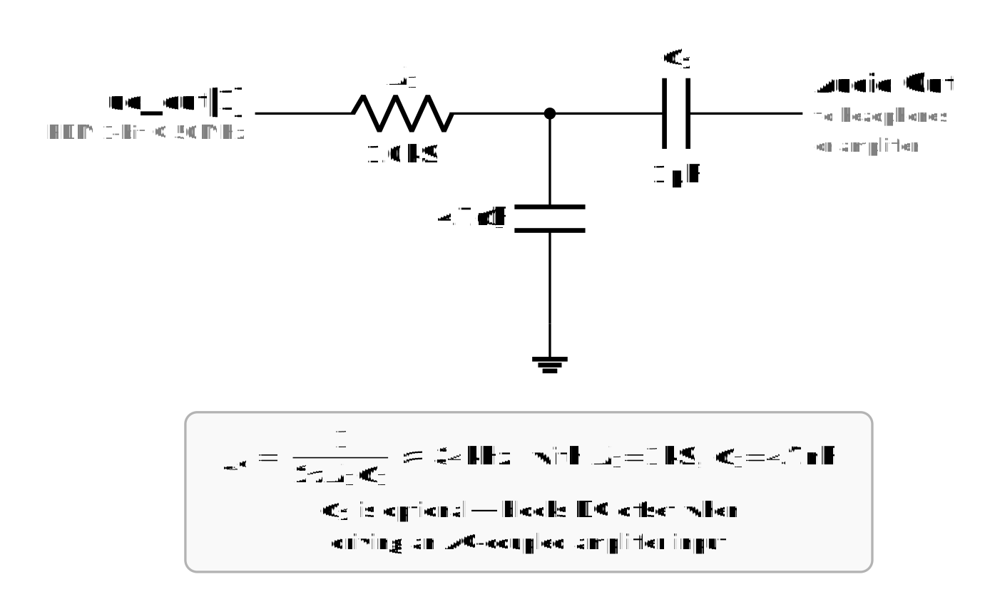

<!---

This file is used to generate your project datasheet. Please fill in the information below and delete any unused
sections.

You can also include images in this folder and reference them in the markdown. Each image must be less than
512 kb in size, and the combined size of all images must be less than 1 MB.
-->

## How it works

This is a single-voice SID (MOS 6581) synthesizer implemented in Verilog. It receives register writes over SPI and produces a 1-bit PDM audio output via a first-order delta-sigma DAC.

**Architecture:**

- **SPI slave** (`spi_regs`) — CPOL=0/CPHA=0, 24-bit write-only transactions. Drives a 5-register bank controlling frequency, pulse width, ADSR rates, and waveform selection.
- **SID voice** (`sid_voice`) — 24-bit phase accumulator with four waveform generators (sawtooth, triangle, pulse, noise via 23-bit LFSR). Waveforms are OR-combined and shaped by an 8-bit ADSR envelope.
- **ADSR envelope** (`sid_asdr_generator`) — Linear attack/decay/sustain/release with power-of-2 rate prescalers, matching the original SID timing.
- **Delta-sigma DAC** (`delta_sigma_dac`) — First-order modulator converting the 12-bit audio sample to a 1-bit PDM stream at the system clock rate (50 MHz).

**Register map (SPI address → 16-bit data):**

| Addr | Register | Description |
|------|----------|-------------|
| 0 | Frequency | 16-bit phase increment (sets pitch) |
| 1 | Pulse Width | 12-bit pulse width for pulse waveform |
| 2 | Attack/Decay | attack[3:0] / decay[7:4] rate indices |
| 3 | Sustain/Release | sustain[3:0] / release[7:4] levels/rates |
| 4 | Waveform | {noise, pulse, saw, tri, test, ring, sync, gate} |

## How to test

Connect an SPI master (e.g. microcontroller or Raspberry Pi) to `ui_in[0:2]`:

1. Write frequency to register 0 (e.g. 4291 for ~C4 at 50 MHz)
2. Write attack/decay to register 2 (e.g. 0x0009 for fast attack, medium decay)
3. Write sustain/release to register 3 (e.g. 0x00F0 for full sustain)
4. Write waveform to register 4 with gate bit set (e.g. 0x0021 for sawtooth + gate)
5. Listen to the PDM output on `uo_out[1]` through a reconstruction filter

## External hardware

An RC low-pass reconstruction filter is needed on the PDM output (`uo_out[1]`) to recover the analog audio signal:

- **R1** = 1.0 kOhm (series)
- **C1** = 4.7 nF (shunt to ground) — gives fc ~ 34 kHz
- **C2** = 1 uF (optional AC-coupling cap for amplifier input)

Connect the filter output to headphones or an audio amplifier.

