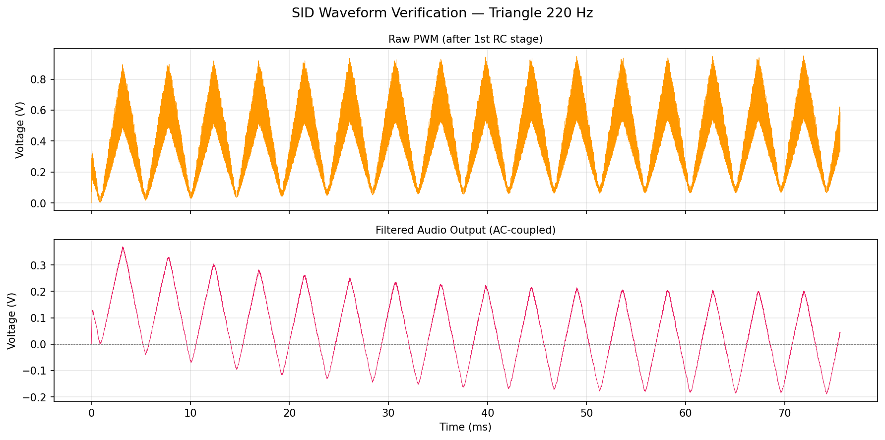
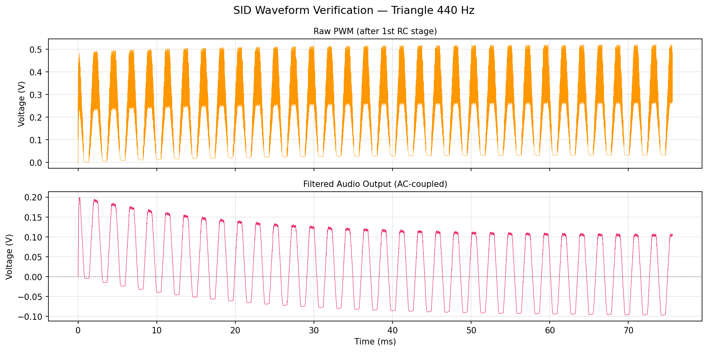
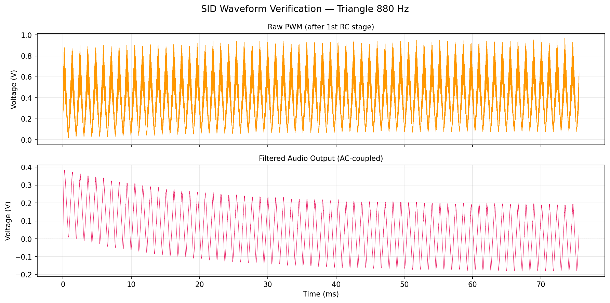
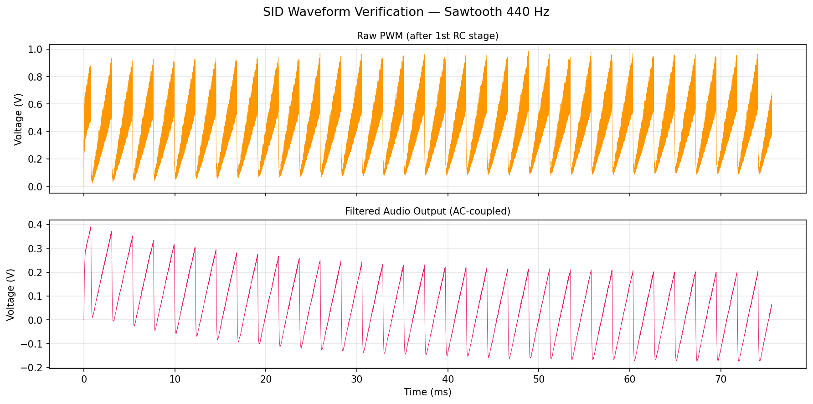
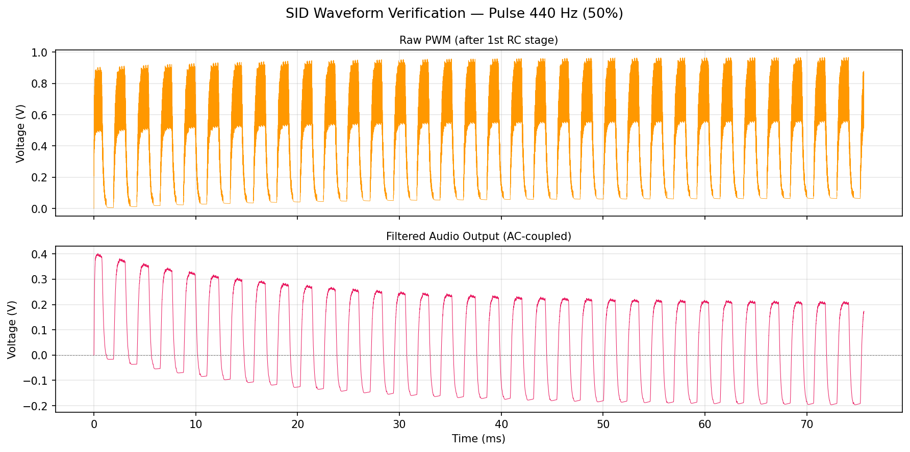
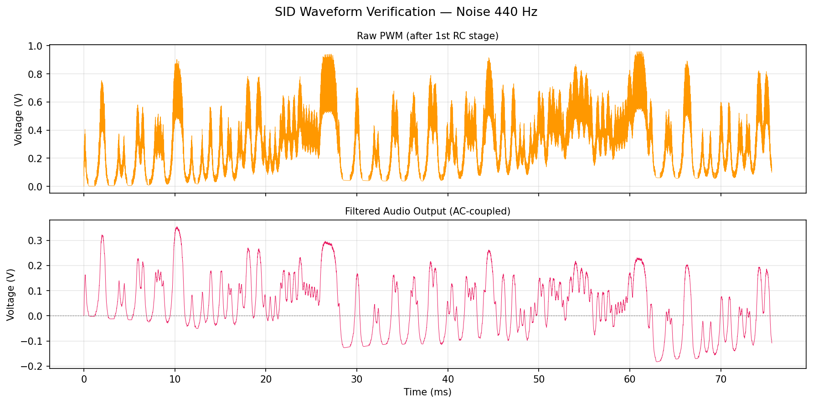

# SID Waveform Verification Report

**Date:** 2026-03-04 17:38
**Capture duration:** 75 ms per tone (1,800,000 cycles at 24 MHz)
**Attack settle:** 200,000 cycles (~8.3 ms)
**Filter:** 3rd-order RC LPF (R=3.3k x3, C=4.7nF x3) + Cac=1uF + Rload=10k

---

## Frequency Sweep (Triangle 220 / 440 / 880 Hz)

Verifies that the SID tone generator produces correct frequency output
across one octave below and above A4 (440 Hz).

| # | Frequency | Freq Reg | Waveform Reg | PWL File |
|---|-----------|----------|-------------|----------|
| 1 | 220 Hz | 0x0E6B | 0x11 | `wv_tri_220.pwl` |
| 2 | 440 Hz | 0x1CD6 | 0x11 | `wv_tri_440.pwl` |
| 3 | 880 Hz | 0x39AC | 0x11 | `wv_tri_880.pwl` |

### Triangle 220 Hz

### Triangle 440 Hz

### Triangle 880 Hz

---

## Waveform Comparison (440 Hz)

Demonstrates all four SID waveform types at the same frequency.

| # | Waveform | Waveform Reg | PWL File |
|---|----------|-------------|----------|
| 1 | Triangle | 0x11 | `wv_tri_440.pwl` |
| 2 | Sawtooth | 0x21 | `wv_saw_440.pwl` |
| 3 | Pulse | 0x41 | `wv_pulse_440.pwl` |
| 4 | Noise | 0x81 | `wv_noise_440.pwl` |

### Triangle 440 Hz

### Sawtooth 440 Hz

### Pulse 440 Hz (50%)

### Noise 440 Hz

---

## Summary

- **Tones captured:** 6/6
- **Pass criteria:** All 6 PWL files generated, WAVs audible at correct pitch

### Output Files

- `wv_tri_220`: PWL=yes WAV=yes PNG=yes [OK]
- `wv_tri_440`: PWL=yes WAV=yes PNG=yes [OK]
- `wv_tri_880`: PWL=yes WAV=yes PNG=yes [OK]
- `wv_saw_440`: PWL=yes WAV=yes PNG=yes [OK]
- `wv_pulse_440`: PWL=yes WAV=yes PNG=yes [OK]
- `wv_noise_440`: PWL=yes WAV=yes PNG=yes [OK]
