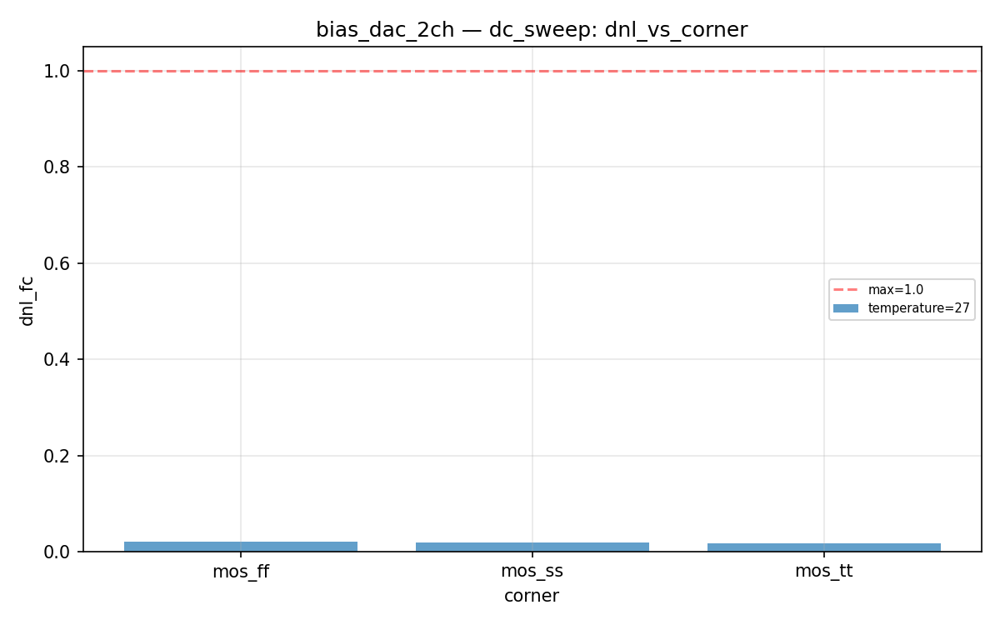
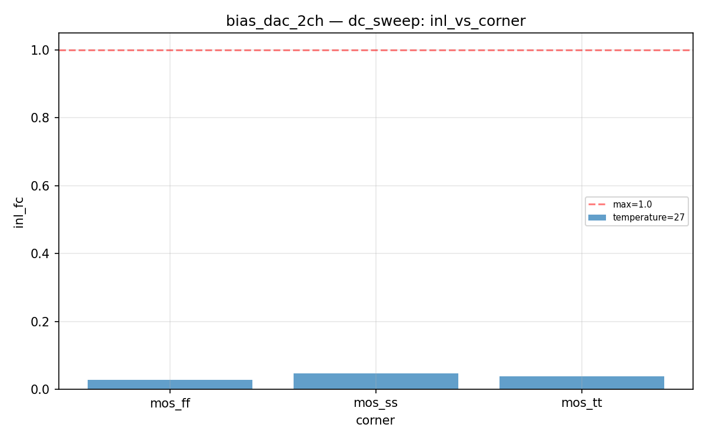

# bias_dac_2ch Datasheet

**Dual 4-bit R-2R bias DAC for fc and Q control**

| Field | Value |
|-------|-------|
| PDK | ihp-sg13g2 |
| Designer | shue |
| Created | March 5, 2026 |
| License | Apache 2.0 |
| Characterization Date | 2026-03-05 18:43 |
| Total Tests | 3 |
| Passed | 3 |
| Failed | 0 |
| **Overall** | **PASS** |

## Pin Description

| Pin | Direction | Type | Description |
|-----|-----------|------|-------------|
| dfc3 | input | digital | FC channel bit 3 (MSB) |
| dfc2 | input | digital | FC channel bit 2 |
| dfc1 | input | digital | FC channel bit 1 |
| dfc0 | input | digital | FC channel bit 0 (LSB) |
| dq3 | input | digital | Q channel bit 3 (MSB) |
| dq2 | input | digital | Q channel bit 2 |
| dq1 | input | digital | Q channel bit 1 |
| dq0 | input | digital | Q channel bit 0 (LSB) |
| vout_fc | output | signal | FC channel analog output (0..vdd V) |
| vout_q | output | signal | Q channel analog output (0..vdd V) |
| vdd | inout | power | Positive power supply (1.08..1.32 V) |
| vss | inout | ground | Ground |

## Default Conditions

| Condition | Display | Typical | Unit |
|-----------|---------|---------|------|
| vdd | Vdd | 1.2 | V |
| temperature | Temp | 27 | °C |
| corner | Corner | mos_tt |  |

## Characterization Results

### DC Sweep Linearity

DC transfer function — sweep all 16 codes per channel

**Specifications:**

| Parameter | Display | Unit | Min | Max |
|-----------|---------|------|-----|-----|
| inl_fc | INL (FC) | LSB |  | 1.0 |
| dnl_fc | DNL (FC) | LSB |  | 1.0 |
| inl_q | INL (Q) | LSB |  | 1.0 |
| dnl_q | DNL (Q) | LSB |  | 1.0 |

**Results:**

| vdd | temperature | corner | inl_fc | dnl_fc | inl_q | dnl_q | Status |
|---|---|---|---|---|---|---|---|
| 1.2 | 27 | mos_tt | 0.0384 | 0.0188 | 0.0000e+00 | 0.0000e+00 | PASS |
| 1.2 | 27 | mos_ff | 0.0292 | 0.0214 | 0.0000e+00 | 0.0000e+00 | PASS |
| 1.2 | 27 | mos_ss | 0.0470 | 0.0193 | 0.0000e+00 | 0.0000e+00 | PASS |

**Plots:**

---
*Generated by run_cace_sims.py on 2026-03-05 18:43:46*
