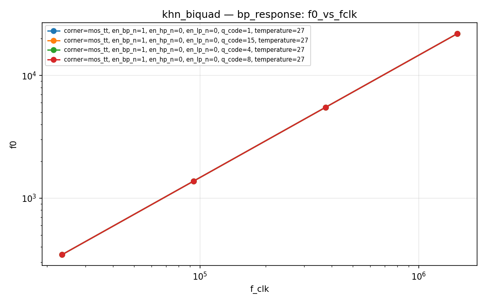
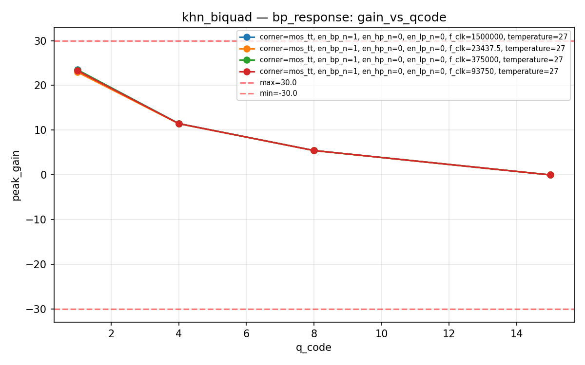
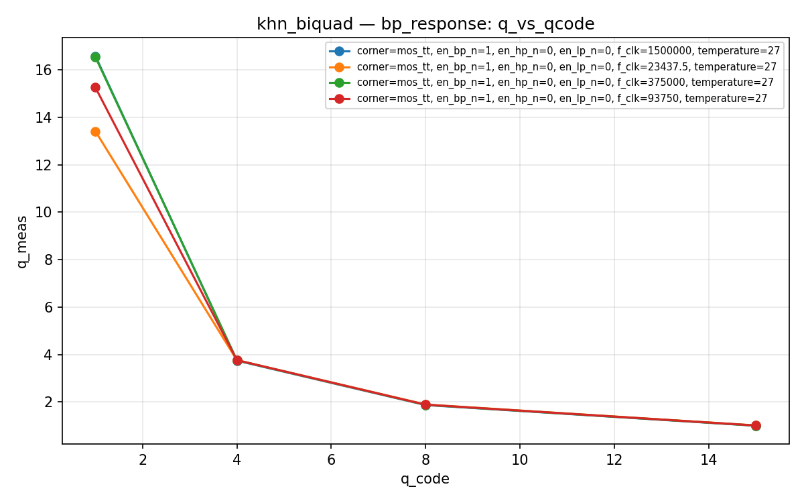
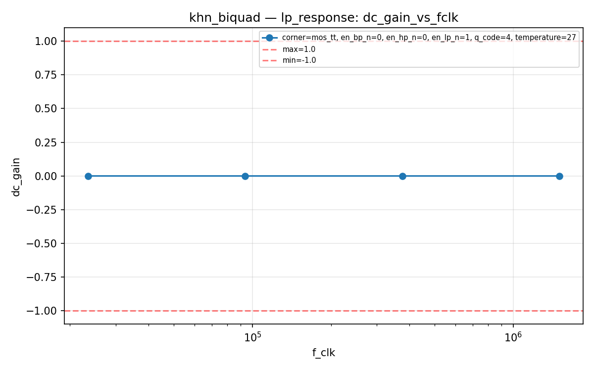
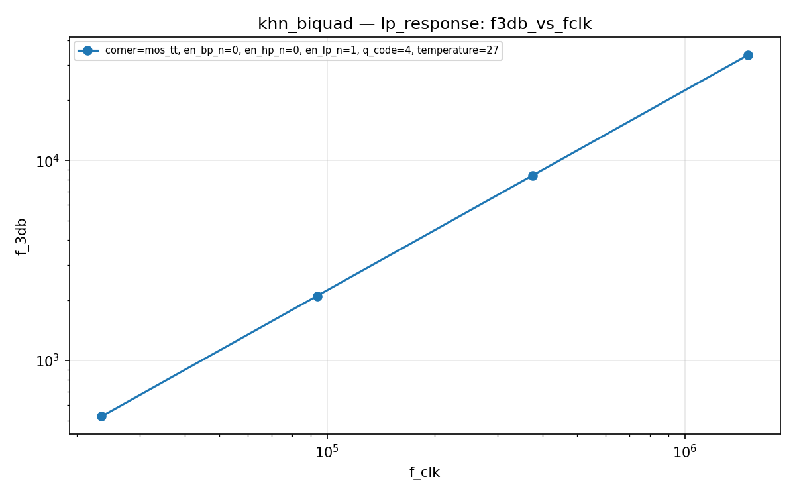
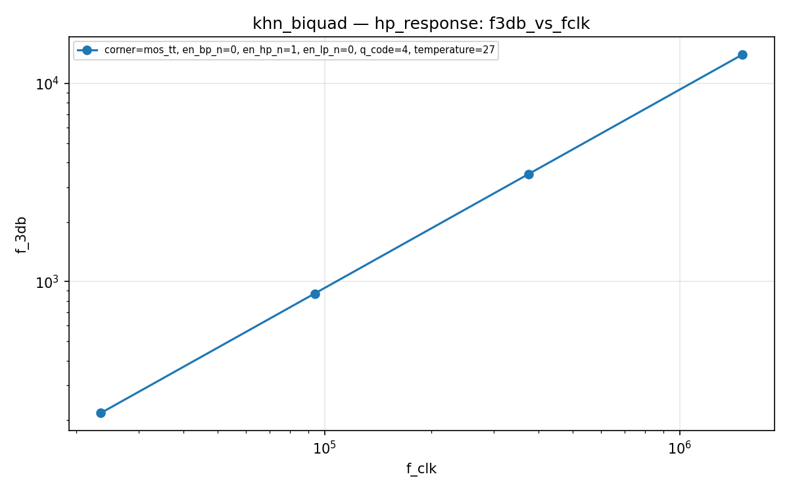
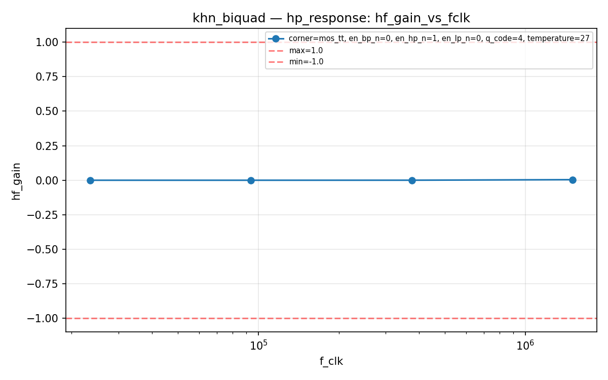
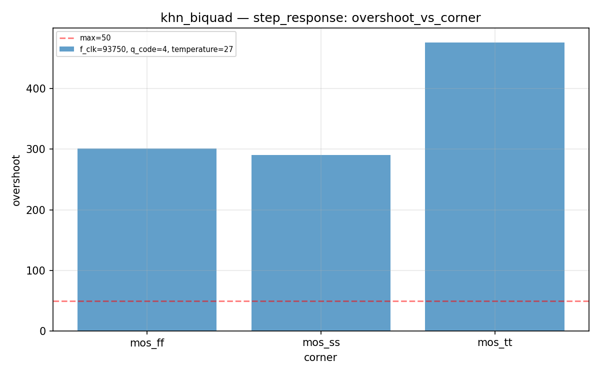
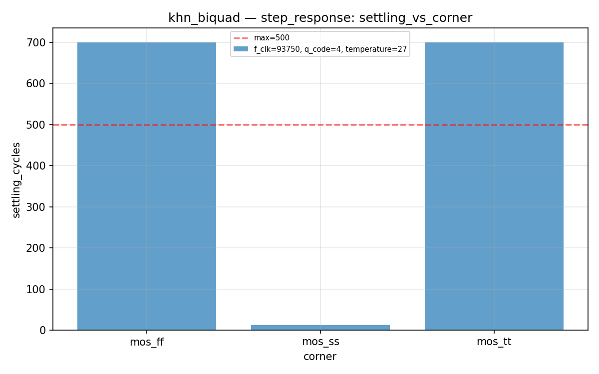

# khn_biquad Datasheet

**KHN 2-OTA SC biquad filter with HP reconstruction and output mixer**

| Field | Value |
|-------|-------|
| PDK | ihp-sg13g2 |
| Designer | shue |
| Created | March 11, 2026 |
| License | Apache 2.0 |
| Characterization Date | 2026-03-11 05:20 |
| Total Tests | 27 |
| Passed | 24 |
| Failed | 3 |
| **Overall** | **FAIL** |

## Pin Description

| Pin | Direction | Type | Description |
|-----|-----------|------|-------------|
| vin | input | signal | Audio input signal (0..vdd V) |
| vout | output | signal | Filtered output (LP+BP+HP mixer) (0..vdd V) |
| en_lp | input | digital | Enable low-pass output in mixer |
| en_bp | input | digital | Enable band-pass output in mixer |
| en_hp | input | digital | Enable high-pass output in mixer |
| sc_clk | input | digital | Switching clock (sets center frequency) |
| q0 | input | digital | Q tuning bit 0 (LSB) |
| q1 | input | digital | Q tuning bit 1 |
| q2 | input | digital | Q tuning bit 2 |
| q3 | input | digital | Q tuning bit 3 (MSB) |
| vdd | inout | power | Positive power supply (1.08..1.32 V) |
| vss | inout | ground | Ground |

## Default Conditions

| Condition | Display | Typical | Unit |
|-----------|---------|---------|------|
| vdd | Vdd | 1.2 | V |
| temperature | Temp | 27 | °C |
| corner | Corner | mos_tt |  |
| f_clk | f_clk | 93750 | Hz |
| q_code | Q code | 4 |  |

## Characterization Results

### Band-Pass Response

BP mode — center frequency, peak gain, and Q factor

**Specifications:**

| Parameter | Display | Unit | Min | Max |
|-----------|---------|------|-----|-----|
| f0 | Center Frequency | Hz | any | any |
| peak_gain | BP Peak Gain | dB | -30.0 | 30.0 |
| q_meas | Measured Q |  | any | any |

**Results:**

| vdd | temperature | corner | en_lp_n | en_bp_n | en_hp_n | f_clk | q_code | f0 | peak_gain | q_meas | Status |
|---|---|---|---|---|---|---|---|---|---|---|---|
| 1.2 | 27 | mos_tt | 0 | 1 | 0 | 23437.5 | 1 | 346.7369 | 22.9556 | 13.4197 | PASS |
| 1.2 | 27 | mos_tt | 0 | 1 | 0 | 23437.5 | 4 | 346.7369 | 11.4199 | 3.7619 | PASS |
| 1.2 | 27 | mos_tt | 0 | 1 | 0 | 23437.5 | 8 | 346.7369 | 5.4262 | 1.8922 | PASS |
| 1.2 | 27 | mos_tt | 0 | 1 | 0 | 23437.5 | 15 | 346.7369 | -0.0274 | 1.0112 | PASS |
| 1.2 | 27 | mos_tt | 0 | 1 | 0 | 93750 | 1 | 1380.3843 | 23.2871 | 15.2646 | PASS |
| 1.2 | 27 | mos_tt | 0 | 1 | 0 | 93750 | 4 | 1380.3843 | 11.4424 | 3.7637 | PASS |
| 1.2 | 27 | mos_tt | 0 | 1 | 0 | 93750 | 8 | 1380.3843 | 5.4318 | 1.8862 | PASS |
| 1.2 | 27 | mos_tt | 0 | 1 | 0 | 93750 | 15 | 1380.3843 | -0.0258 | 1.0068 | PASS |
| 1.2 | 27 | mos_tt | 0 | 1 | 0 | 375000 | 1 | 5495.4087 | 23.4687 | 16.5518 | PASS |
| 1.2 | 27 | mos_tt | 0 | 1 | 0 | 375000 | 4 | 5495.4087 | 11.4540 | 3.7579 | PASS |
| 1.2 | 27 | mos_tt | 0 | 1 | 0 | 375000 | 8 | 5495.4087 | 5.4348 | 1.8789 | PASS |
| 1.2 | 27 | mos_tt | 0 | 1 | 0 | 375000 | 15 | 5495.4087 | -0.0249 | 1.0022 | PASS |
| 1.2 | 27 | mos_tt | 0 | 1 | 0 | 1500000 | 1 | 2.1878e+04 | 23.4804 | 16.5867 | PASS |
| 1.2 | 27 | mos_tt | 0 | 1 | 0 | 1500000 | 4 | 2.1878e+04 | 11.4547 | 3.7430 | PASS |
| 1.2 | 27 | mos_tt | 0 | 1 | 0 | 1500000 | 8 | 2.1878e+04 | 5.4349 | 1.8705 | PASS |
| 1.2 | 27 | mos_tt | 0 | 1 | 0 | 1500000 | 15 | 2.1878e+04 | -0.0249 | 0.9974 | PASS |

**Plots:**

### Low-Pass Response

LP mode — DC gain and -3dB frequency

**Specifications:**

| Parameter | Display | Unit | Min | Max |
|-----------|---------|------|-----|-----|
| dc_gain | DC Gain | dB | -1.0 | 1.0 |
| f_3db | -3dB Frequency | Hz | any | any |

**Results:**

| vdd | temperature | corner | en_lp_n | en_bp_n | en_hp_n | f_clk | q_code | dc_gain | f_3db | Status |
|---|---|---|---|---|---|---|---|---|---|---|
| 1.2 | 27 | mos_tt | 1 | 0 | 0 | 23437.5 | 4 | 6.9094e-05 | 525.3152 | PASS |
| 1.2 | 27 | mos_tt | 1 | 0 | 0 | 93750 | 4 | 2.1632e-06 | 2101.6901 | PASS |
| 1.2 | 27 | mos_tt | 1 | 0 | 0 | 375000 | 4 | -2.0482e-06 | 8408.0485 | PASS |
| 1.2 | 27 | mos_tt | 1 | 0 | 0 | 1500000 | 4 | -2.3011e-06 | 3.3636e+04 | PASS |

**Plots:**

### High-Pass Response

HP mode — high-frequency gain and -3dB corner frequency

**Specifications:**

| Parameter | Display | Unit | Min | Max |
|-----------|---------|------|-----|-----|
| hf_gain | HF Gain | dB | -1.0 | 1.0 |
| f_3db | -3dB Frequency | Hz | any | any |

**Results:**

| vdd | temperature | corner | en_lp_n | en_bp_n | en_hp_n | f_clk | q_code | hf_gain | f_3db | Status |
|---|---|---|---|---|---|---|---|---|---|---|
| 1.2 | 27 | mos_tt | 0 | 0 | 1 | 23437.5 | 4 | 1.0423e-06 | 217.7930 | PASS |
| 1.2 | 27 | mos_tt | 0 | 0 | 1 | 93750 | 4 | 1.6329e-05 | 871.1866 | PASS |
| 1.2 | 27 | mos_tt | 0 | 0 | 1 | 375000 | 4 | 2.6092e-04 | 3484.6944 | PASS |
| 1.2 | 27 | mos_tt | 0 | 0 | 1 | 1500000 | 4 | 0.0042 | 1.3941e+04 | PASS |

**Plots:**

### Step Response

Transistor-level transient step response (HP mode)

**Specifications:**

| Parameter | Display | Unit | Min | Max |
|-----------|---------|------|-----|-----|
| v_final | Final Value | V | any | any |
| settling_cycles | Settling Cycles |  | any | 500 |
| overshoot | Overshoot | % | any | 50 |

**Results:**

| vdd | temperature | f_clk | q_code | corner | v_final | settling_cycles | overshoot | Status |
|---|---|---|---|---|---|---|---|---|
| 1.2 | 27 | 93750 | 4 | mos_tt | 0.4714 | 700.0000 | 475.9566 | **FAIL** |
| 1.2 | 27 | 93750 | 4 | mos_ff | 0.4741 | 700.0000 | 300.7259 | **FAIL** |
| 1.2 | 27 | 93750 | 4 | mos_ss | 0.4699 | 12.0000 | 290.5666 | **FAIL** |

**Plots:**

---
*Generated by run_cace_sims.py on 2026-03-11 05:20:24*
