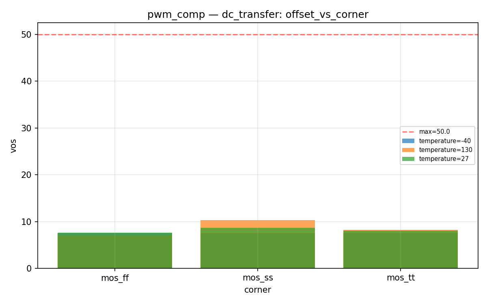
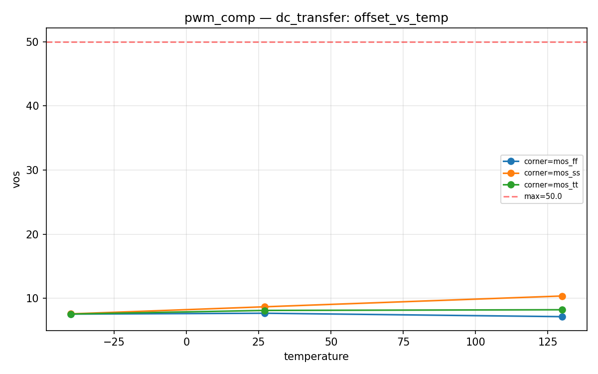
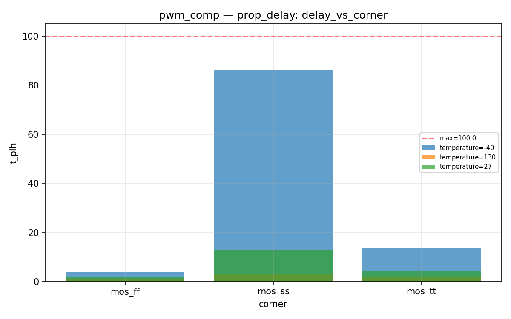
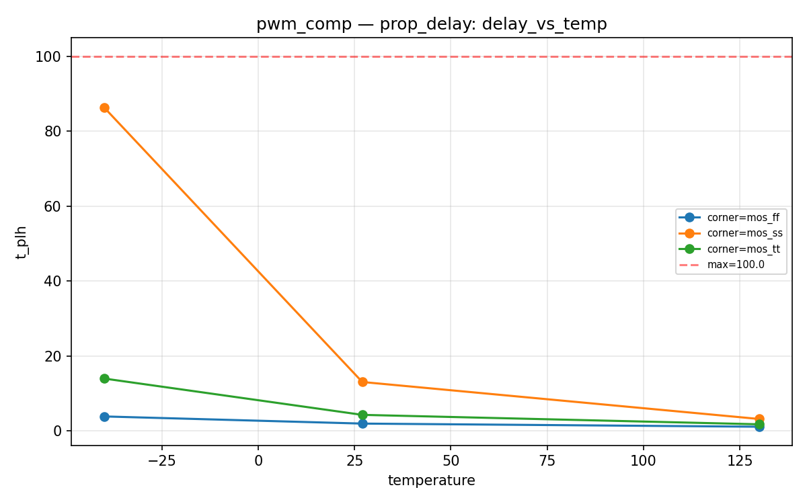
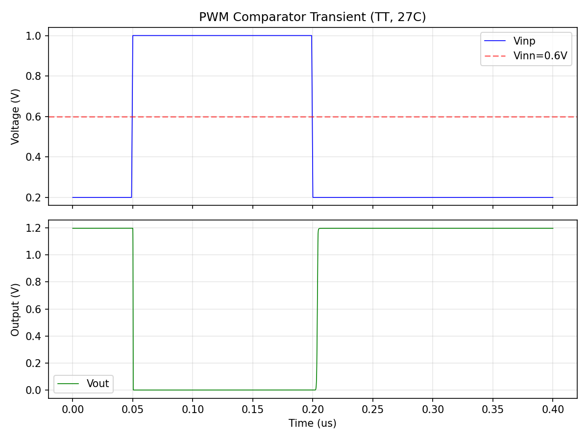

# pwm_comp Datasheet

**PWM comparator — 5T OTA with CMOS inverter output stage**

| Field | Value |
|-------|-------|
| PDK | ihp-sg13g2 |
| Designer | shue |
| Created | March 6, 2026 |
| License | Apache 2.0 |
| Characterization Date | 2026-03-08 20:27 |
| Total Tests | 18 |
| Passed | 18 |
| Failed | 0 |
| **Overall** | **PASS** |

## Pin Description

| Pin | Direction | Type | Description |
|-----|-----------|------|-------------|
| vinp | input | signal | Non-inverting input (from SVF output) (0..vdd V) |
| vinn | input | signal | Inverting input (from ramp DAC) (0..vdd V) |
| out | output | signal | Digital PWM output (rail-to-rail) |
| vdd | inout | power | Positive power supply (1.08..1.32 V) |
| vss | inout | ground | Ground |

## Default Conditions

| Condition | Display | Typical | Unit |
|-----------|---------|---------|------|
| vdd | Vdd | 1.2 | V |
| temperature | Temp | 27 | °C |
| corner | Corner | mos_tt |  |

## Characterization Results

### DC Transfer / Offset

DC transfer curve — sweep Vinp with Vinn at mid-rail

**Specifications:**

| Parameter | Display | Unit | Min | Max |
|-----------|---------|------|-----|-----|
| vos | Input Offset Voltage | mV |  | 50.0 |
| trip_point | Trip Point | V | 0.4 | 0.8 |

**Results:**

| vdd | temperature | corner | vos | trip_point | Status |
|---|---|---|---|---|---|
| 1.2 | -40 | mos_tt | 7.5653 | 0.5924 | PASS |
| 1.2 | -40 | mos_ff | 7.5539 | 0.5924 | PASS |
| 1.2 | -40 | mos_ss | 7.5888 | 0.5924 | PASS |
| 1.2 | 27 | mos_tt | 8.1264 | 0.5919 | PASS |
| 1.2 | 27 | mos_ff | 7.6886 | 0.5923 | PASS |
| 1.2 | 27 | mos_ss | 8.6921 | 0.5913 | PASS |
| 1.2 | 130 | mos_tt | 8.2315 | 0.5918 | PASS |
| 1.2 | 130 | mos_ff | 7.1551 | 0.5928 | PASS |
| 1.2 | 130 | mos_ss | 10.3757 | 0.5896 | PASS |

**Plots:**

### Propagation Delay

Propagation delay from input crossing to output transition

**Specifications:**

| Parameter | Display | Unit | Min | Max |
|-----------|---------|------|-----|-----|
| t_plh | tPLH | ns |  | 100.0 |
| t_phl | tPHL | ns |  | 100.0 |

**Results:**

| vdd | temperature | corner | t_plh | t_phl | Status |
|---|---|---|---|---|---|
| 1.2 | -40 | mos_tt | 13.9442 | 0.8931 | PASS |
| 1.2 | -40 | mos_ff | 3.8291 | 0.6493 | PASS |
| 1.2 | -40 | mos_ss | 86.2913 | 1.3226 | PASS |
| 1.2 | 27 | mos_tt | 4.2518 | 0.7919 | PASS |
| 1.2 | 27 | mos_ff | 1.9210 | 0.5813 | PASS |
| 1.2 | 27 | mos_ss | 13.0236 | 1.1026 | PASS |
| 1.2 | 130 | mos_tt | 1.7300 | 0.6600 | PASS |
| 1.2 | 130 | mos_ff | 1.0821 | 0.5092 | PASS |
| 1.2 | 130 | mos_ss | 3.1504 | 0.8807 | PASS |

**Plots:**

## Composite Plots

### Pwm Comp Transient

---
*Generated by run_cace_sims.py on 2026-03-08 20:27:27*
