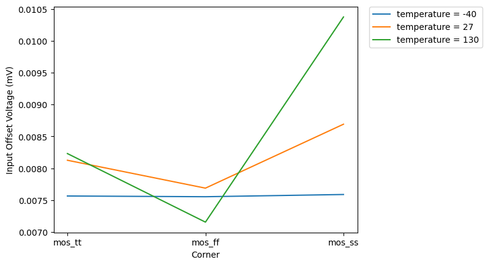
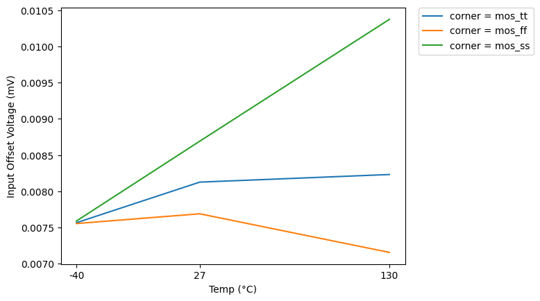
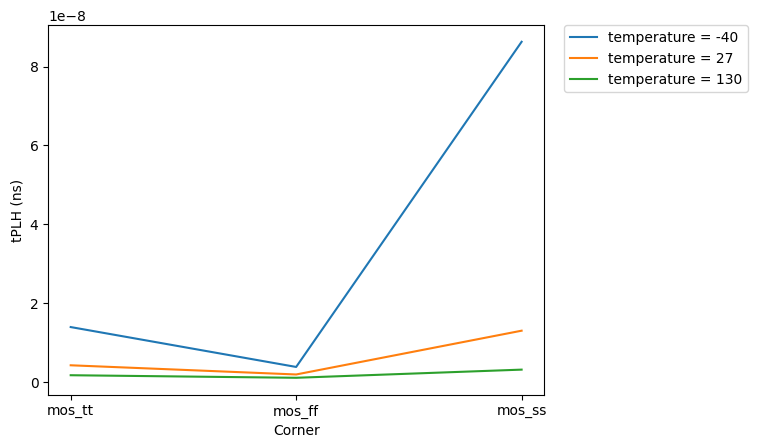
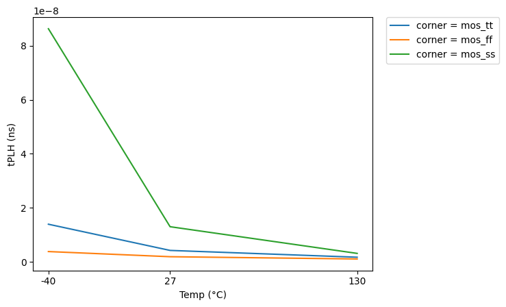

# CACE Summary for pwm_comp

**netlist source**: schematic

|      Parameter       |         Tool         |     Result      | Min Limit  |  Min Value   | Typ Target |  Typ Value   | Max Limit  |  Max Value   |  Status  |
| :------------------- | :------------------- | :-------------- | ---------: | -----------: | ---------: | -----------: | ---------: | -----------: | :------: |
| Input Offset Voltage | ngspice              | vos                  |               ​ |          ​ |            ​ |          ​ |      50.0 mV |  10.376 mV |   Pass ✅    |
| Trip Point           | ngspice              | trip_point           |           0.4 V |    0.590 V |            ​ |          ​ |        0.8 V |    0.593 V |   Pass ✅    |
| tPLH                 | ngspice              | t_plh                |               ​ |          ​ |            ​ |          ​ |     100.0 ns |  86.291 ns |   Pass ✅    |
| tPHL                 | ngspice              | t_phl                |               ​ |          ​ |            ​ |          ​ |     100.0 ns |   1.323 ns |   Pass ✅    |

## Plots

## offset_vs_corner

## offset_vs_temp

## delay_vs_corner

## delay_vs_temp

