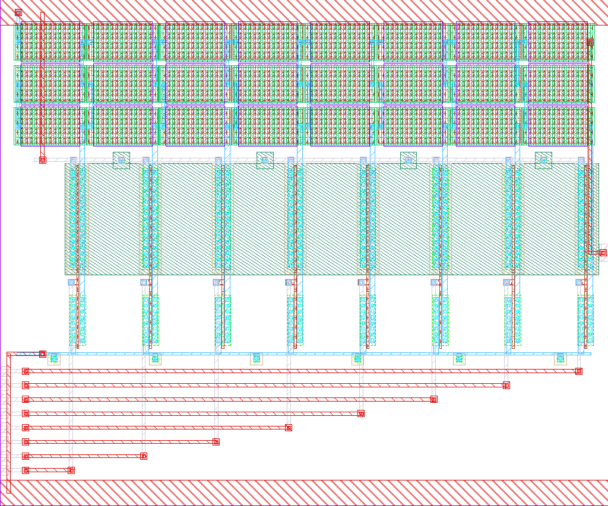
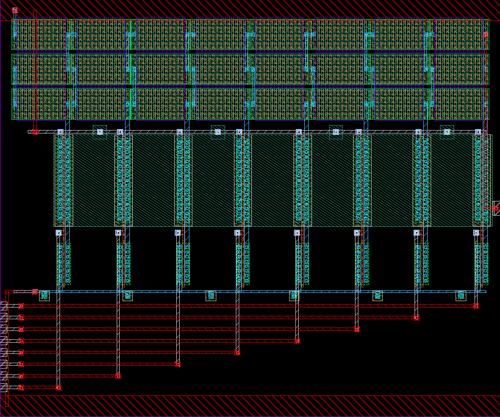

# r2r_dac_8bit

- Description: 8-bit R-2R DAC with CMOS complementary shunt switches
- PDK: ihp-sg13g2

## Authorship

- Designer: shue
- Created: March 3, 2026
- License: Apache 2.0
- Company: None
- Last modified: None

## Pins

- d0
  + Description: Digital input bit 0 (LSB)
  + Type: digital
  + Direction: input
- d1
  + Description: Digital input bit 1
  + Type: digital
  + Direction: input
- d2
  + Description: Digital input bit 2
  + Type: digital
  + Direction: input
- d3
  + Description: Digital input bit 3
  + Type: digital
  + Direction: input
- d4
  + Description: Digital input bit 4
  + Type: digital
  + Direction: input
- d5
  + Description: Digital input bit 5
  + Type: digital
  + Direction: input
- d6
  + Description: Digital input bit 6
  + Type: digital
  + Direction: input
- d7
  + Description: Digital input bit 7 (MSB)
  + Type: digital
  + Direction: input
- vout
  + Description: Analog output voltage
  + Type: signal
  + Direction: output
  + Vmin: 0
  + Vmax: vdd
- vdd
  + Description: Positive power supply
  + Type: power
  + Direction: inout
  + Vmin: 1.08
  + Vmax: 1.32
- vss
  + Description: Ground
  + Type: ground
  + Direction: inout

## Default Conditions

- vdd
  + Description: Power supply voltage
  + Display: Vdd
  + Unit: V
  + Typical: 1.2
- temperature
  + Description: Ambient temperature
  + Display: Temp
  + Unit: °C
  + Typical: 27
- corner
  + Description: Process corner (MOS)
  + Display: Corner
  + Typical: mos_tt

## Symbol

## Schematic

## Layout

