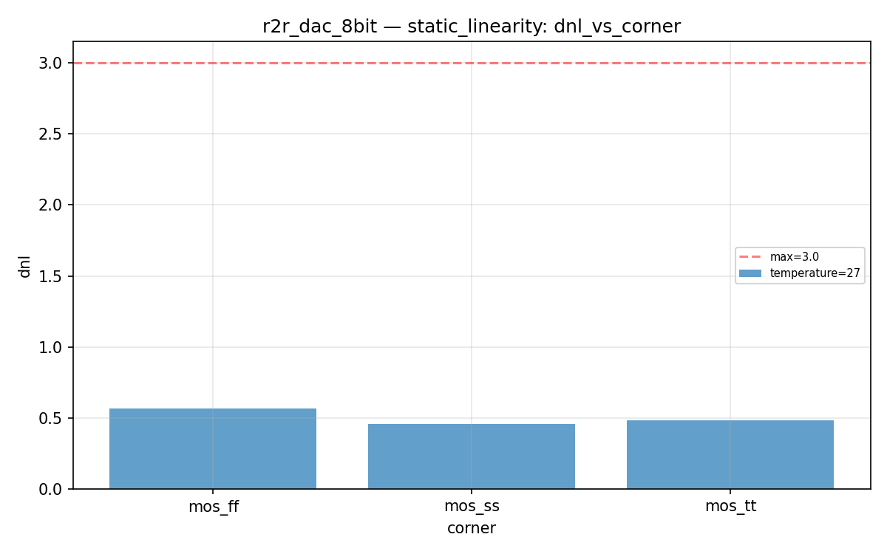
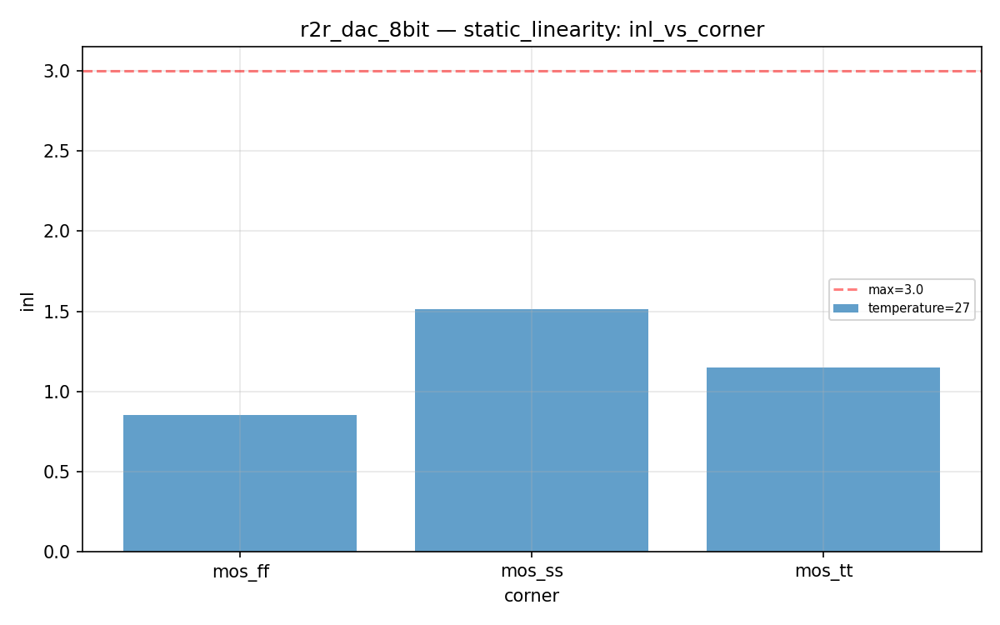
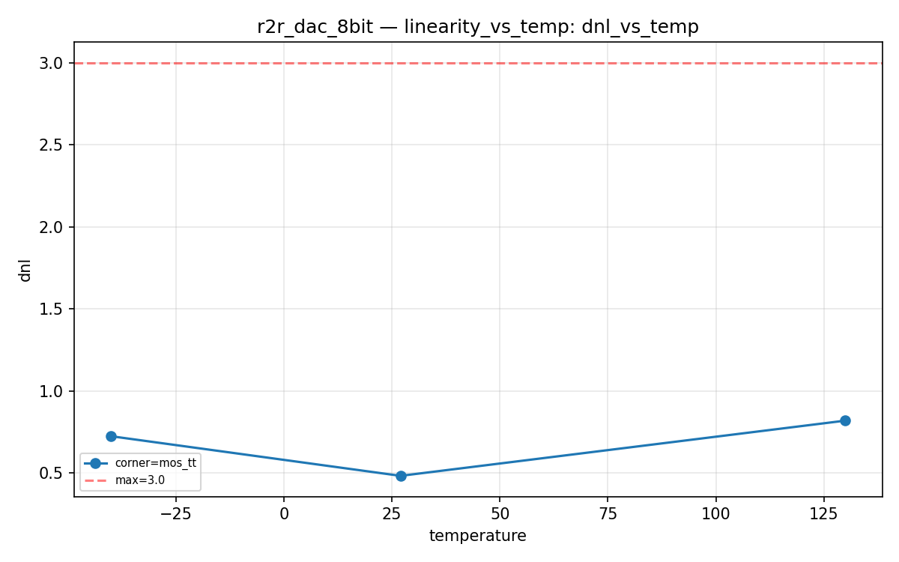
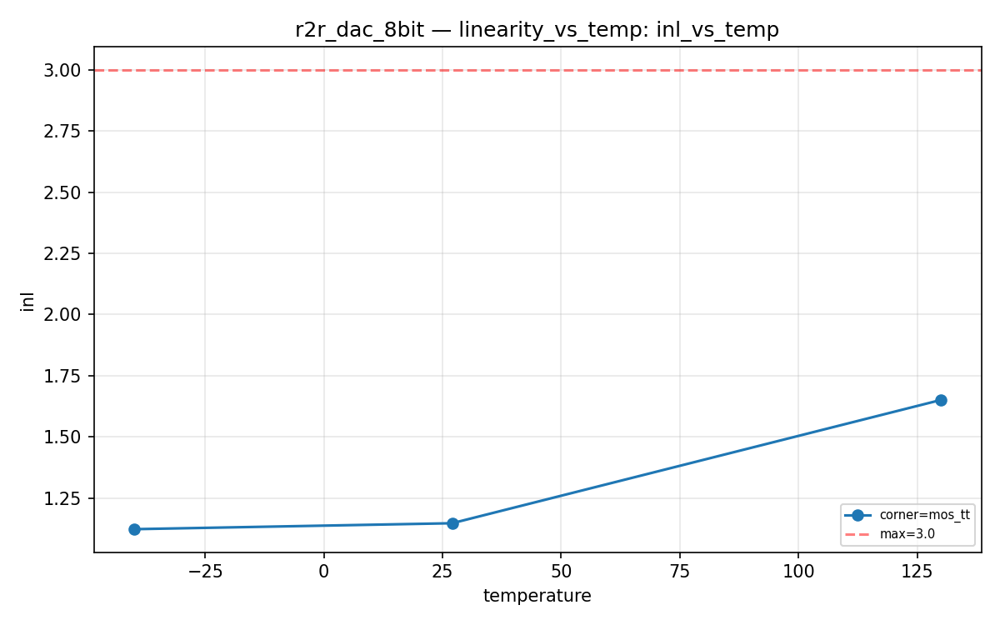
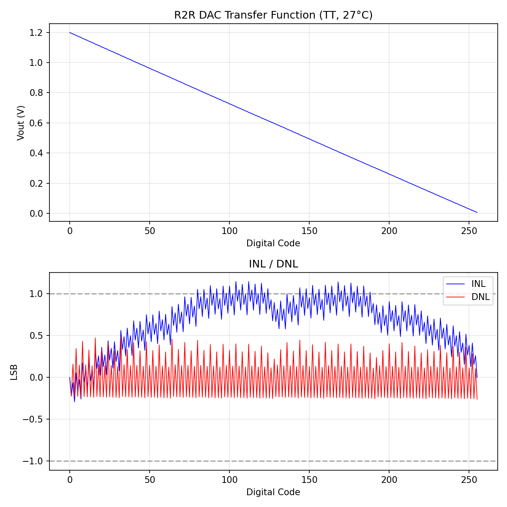

# r2r_dac_8bit Datasheet

**8-bit R-2R DAC with CMOS complementary shunt switches**

| Field | Value |
|-------|-------|
| PDK | ihp-sg13g2 |
| Designer | shue |
| Created | March 3, 2026 |
| License | Apache 2.0 |
| Characterization Date | 2026-03-08 20:27 |
| Total Tests | 15 |
| Passed | 15 |
| Failed | 0 |
| **Overall** | **PASS** |

## Pin Description

| Pin | Direction | Type | Description |
|-----|-----------|------|-------------|
| d0 | input | digital | Digital input bit 0 (LSB) |
| d1 | input | digital | Digital input bit 1 |
| d2 | input | digital | Digital input bit 2 |
| d3 | input | digital | Digital input bit 3 |
| d4 | input | digital | Digital input bit 4 |
| d5 | input | digital | Digital input bit 5 |
| d6 | input | digital | Digital input bit 6 |
| d7 | input | digital | Digital input bit 7 (MSB) |
| vout | output | signal | Analog output voltage (0..vdd V) |
| vdd | inout | power | Positive power supply (1.08..1.32 V) |
| vss | inout | ground | Ground |

## Default Conditions

| Condition | Display | Typical | Unit |
|-----------|---------|---------|------|
| vdd | Vdd | 1.2 | V |
| temperature | Temp | 27 | °C |
| corner | Corner | mos_tt |  |

## Characterization Results

### Static Linearity

DC transfer function — sweep all 256 codes

**Specifications:**

| Parameter | Display | Unit | Min | Max |
|-----------|---------|------|-----|-----|
| inl | INL | LSB |  | 3.0 |
| dnl | DNL | LSB |  | 3.0 |

**Results:**

| vdd | temperature | corner | inl | dnl | Status |
|---|---|---|---|---|---|
| 1.2 | 27 | mos_tt | 1.1480 | 0.4840 | PASS |
| 1.2 | 27 | mos_ff | 0.8529 | 0.5661 | PASS |
| 1.2 | 27 | mos_ss | 1.5147 | 0.4586 | PASS |

**Plots:**

### Linearity vs Temperature

INL/DNL across temperature

**Specifications:**

| Parameter | Display | Unit | Min | Max |
|-----------|---------|------|-----|-----|
| inl | INL | LSB |  | 3.0 |
| dnl | DNL | LSB |  | 3.0 |

**Results:**

| vdd | temperature | corner | inl | dnl | Status |
|---|---|---|---|---|---|
| 1.2 | -40 | mos_tt | 1.1237 | 0.7251 | PASS |
| 1.2 | 27 | mos_tt | 1.1480 | 0.4840 | PASS |
| 1.2 | 130 | mos_tt | 1.6513 | 0.8201 | PASS |

**Plots:**

### Full Scale Range

Output voltage at code 0 and code 255

**Specifications:**

| Parameter | Display | Unit | Min | Max |
|-----------|---------|------|-----|-----|
| vout_min | Vout_min | V |  | 0.05 |
| vout_max | Vout_max | V | 1.1 |  |

**Results:**

| vdd | temperature | corner | vout_min | vout_max | Status |
|---|---|---|---|---|---|
| 1.2 | -40 | mos_tt | 0.0068 | 1.1978 | PASS |
| 1.2 | -40 | mos_ff | 0.0068 | 1.1978 | PASS |
| 1.2 | -40 | mos_ss | 0.0068 | 1.1978 | PASS |
| 1.2 | 27 | mos_tt | 0.0069 | 1.1981 | PASS |
| 1.2 | 27 | mos_ff | 0.0069 | 1.1981 | PASS |
| 1.2 | 27 | mos_ss | 0.0069 | 1.1981 | PASS |
| 1.2 | 130 | mos_tt | 0.0071 | 1.1985 | PASS |
| 1.2 | 130 | mos_ff | 0.0071 | 1.1985 | PASS |
| 1.2 | 130 | mos_ss | 0.0071 | 1.1985 | PASS |

## Composite Plots

### R2R Dac Transfer Inl Dnl

---
*Generated by run_cace_sims.py on 2026-03-08 20:27:15*
