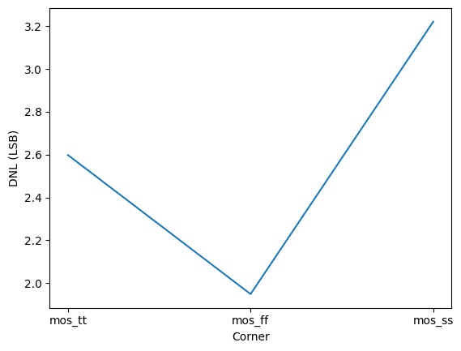
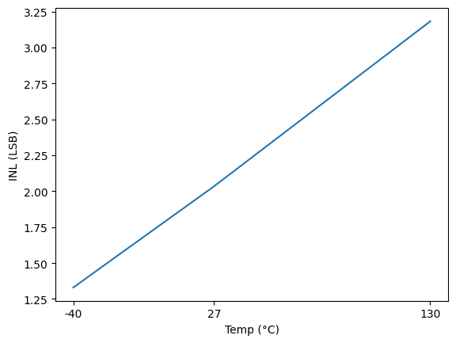
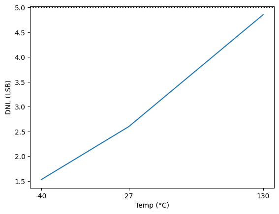

# CACE Summary for r2r_dac_8bit

**netlist source**: schematic

|      Parameter       |         Tool         |     Result      | Min Limit  |  Min Value   | Typ Target |  Typ Value   | Max Limit  |  Max Value   |  Status  |
| :------------------- | :------------------- | :-------------- | ---------: | -----------: | ---------: | -----------: | ---------: | -----------: | :------: |
| INL                  | ngspice              | inl                  |               ​ |          ​ |            ​ |          ​ |      5.0 LSB |  2.748 LSB |   Pass ✅    |
| DNL                  | ngspice              | dnl                  |               ​ |          ​ |            ​ |          ​ |      5.0 LSB |  3.221 LSB |   Pass ✅    |
| INL                  | ngspice              | inl                  |               ​ |          ​ |            ​ |          ​ |      5.0 LSB |  3.182 LSB |   Pass ✅    |
| DNL                  | ngspice              | dnl                  |               ​ |          ​ |            ​ |          ​ |      5.0 LSB |  4.855 LSB |   Pass ✅    |
| Vout_min             | ngspice              | vout_min             |               ​ |          ​ |            ​ |          ​ |       0.05 V |    0.012 V |   Pass ✅    |
| Vout_max             | ngspice              | vout_max             |           1.1 V |    1.197 V |            ​ |          ​ |            ​ |          ​ |   Pass ✅    |

## Plots

## inl_vs_corner

## dnl_vs_corner

## inl_vs_temp

## dnl_vs_temp

