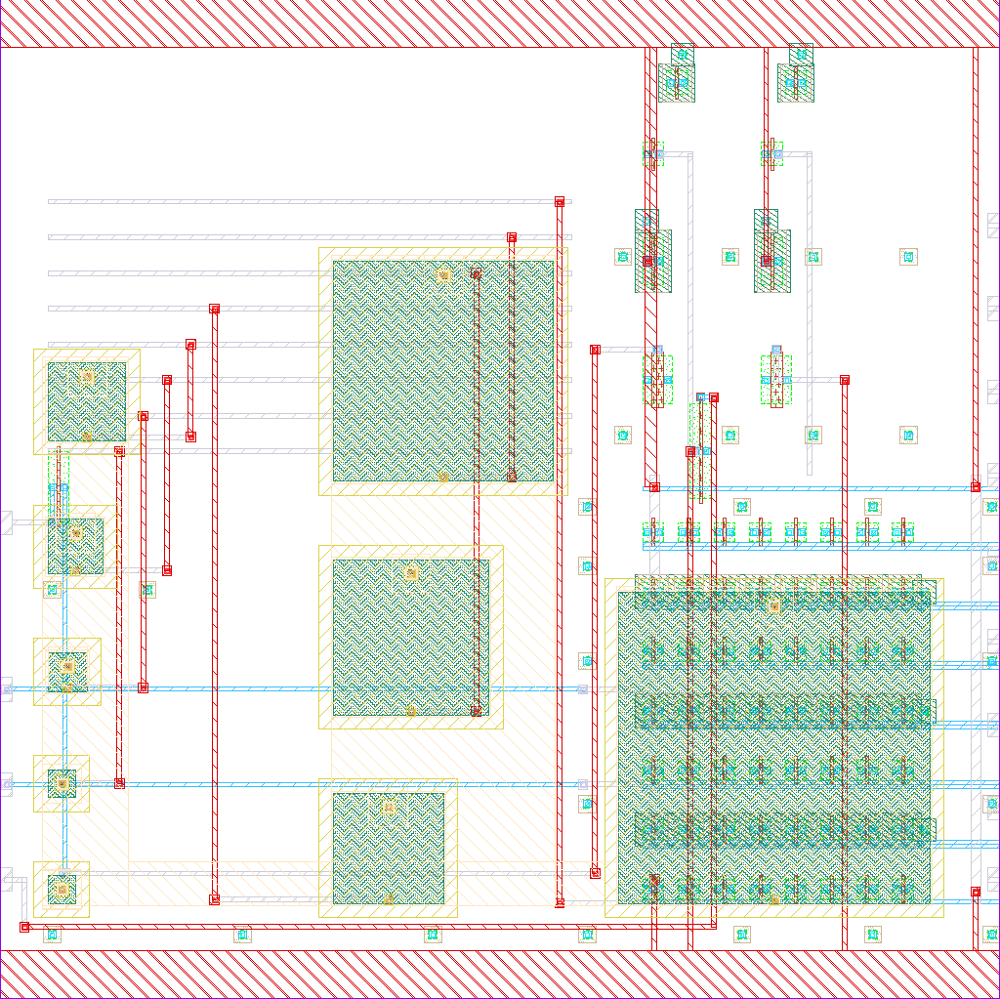
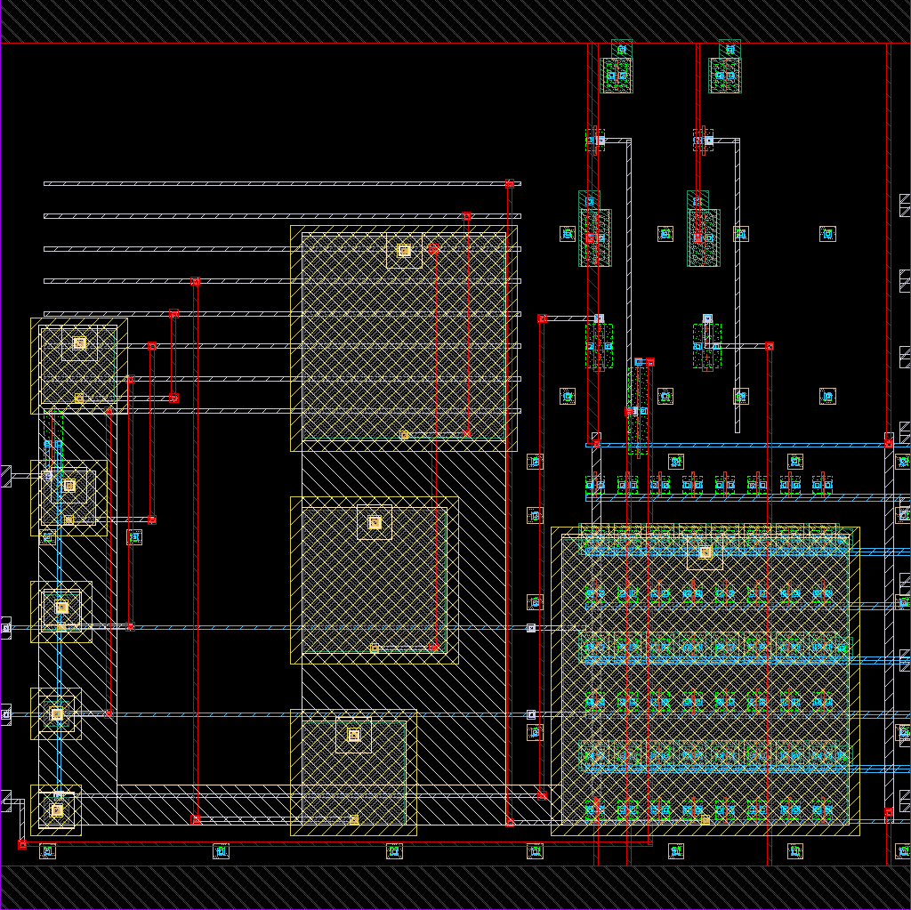

# sar_adc_8bit

- Description: 8-bit successive-approximation ADC with StrongARM comparator
- PDK: ihp-sg13g2

## Authorship

- Designer: shue
- Created: March 3, 2026
- License: Apache 2.0
- Company: None
- Last modified: None

## Pins

- clk
  + Description: Comparator/SAR clock (100 MHz)
  + Type: digital
  + Direction: input
- rst_n
  + Description: Active-low asynchronous reset
  + Type: digital
  + Direction: input
- vin
  + Description: Analog input voltage
  + Type: signal
  + Direction: input
  + Vmin: 0
  + Vmax: vdd
- start
  + Description: Start conversion (rising edge)
  + Type: digital
  + Direction: input
- eoc
  + Description: End-of-conversion pulse
  + Type: digital
  + Direction: output
- dout0
  + Description: Digital output bit 0 (LSB)
  + Type: digital
  + Direction: output
- dout1
  + Description: Digital output bit 1
  + Type: digital
  + Direction: output
- dout2
  + Description: Digital output bit 2
  + Type: digital
  + Direction: output
- dout3
  + Description: Digital output bit 3
  + Type: digital
  + Direction: output
- dout4
  + Description: Digital output bit 4
  + Type: digital
  + Direction: output
- dout5
  + Description: Digital output bit 5
  + Type: digital
  + Direction: output
- dout6
  + Description: Digital output bit 6
  + Type: digital
  + Direction: output
- dout7
  + Description: Digital output bit 7 (MSB)
  + Type: digital
  + Direction: output
- vdd
  + Description: Positive power supply / reference
  + Type: power
  + Direction: inout
  + Vmin: 1.08
  + Vmax: 1.32
- vss
  + Description: Ground
  + Type: ground
  + Direction: inout

## Default Conditions

- vdd
  + Description: Power supply voltage
  + Display: Vdd
  + Unit: V
  + Typical: 1.2
- temperature
  + Description: Ambient temperature
  + Display: Temp
  + Unit: °C
  + Typical: 27
- corner
  + Description: Process corner (MOS)
  + Display: Corner
  + Typical: mos_tt

## Symbol

## Schematic

## Layout

