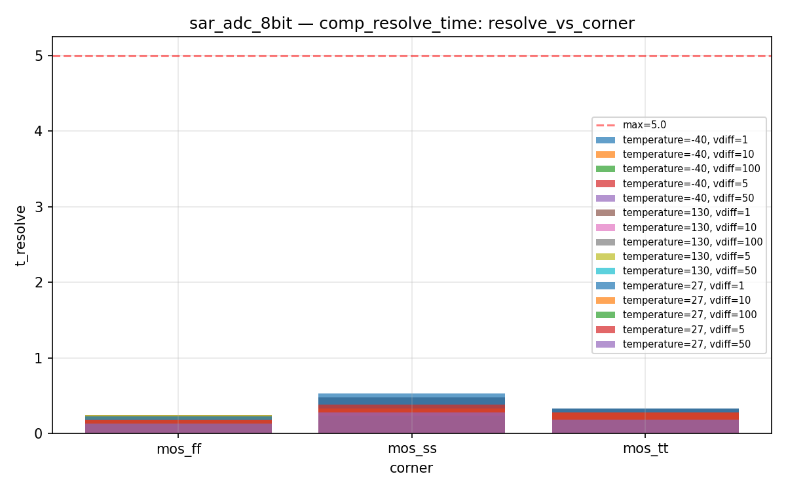
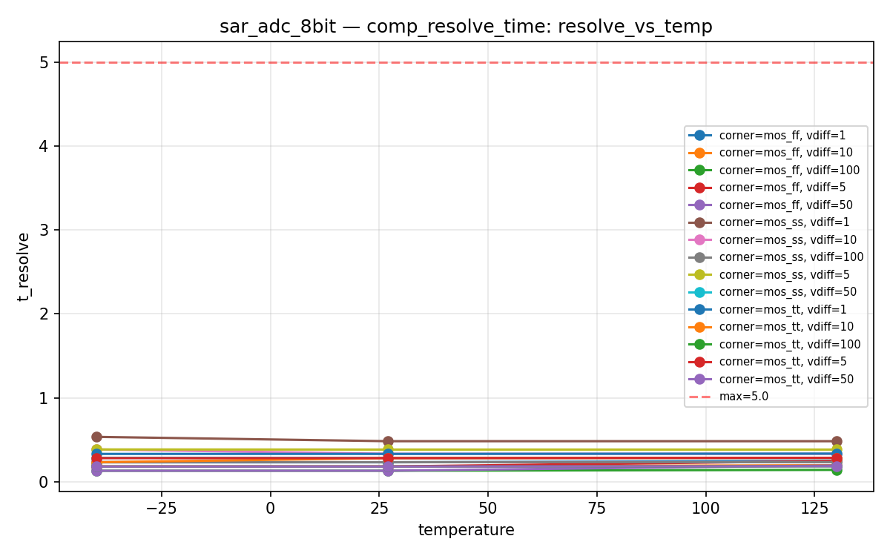
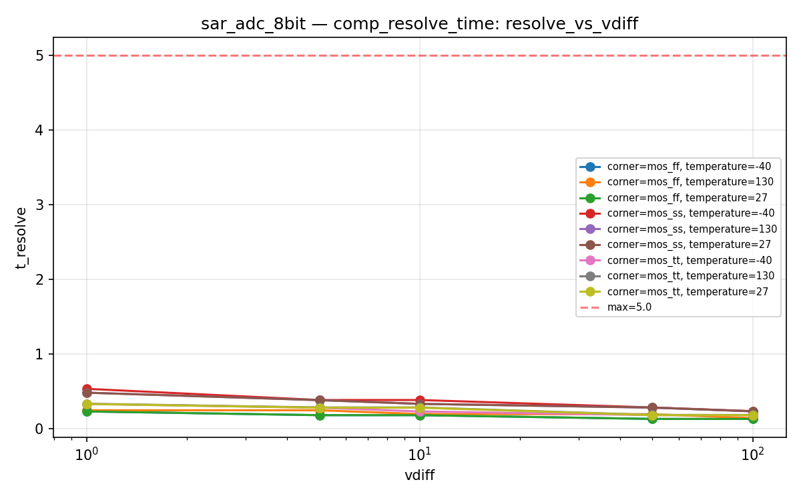
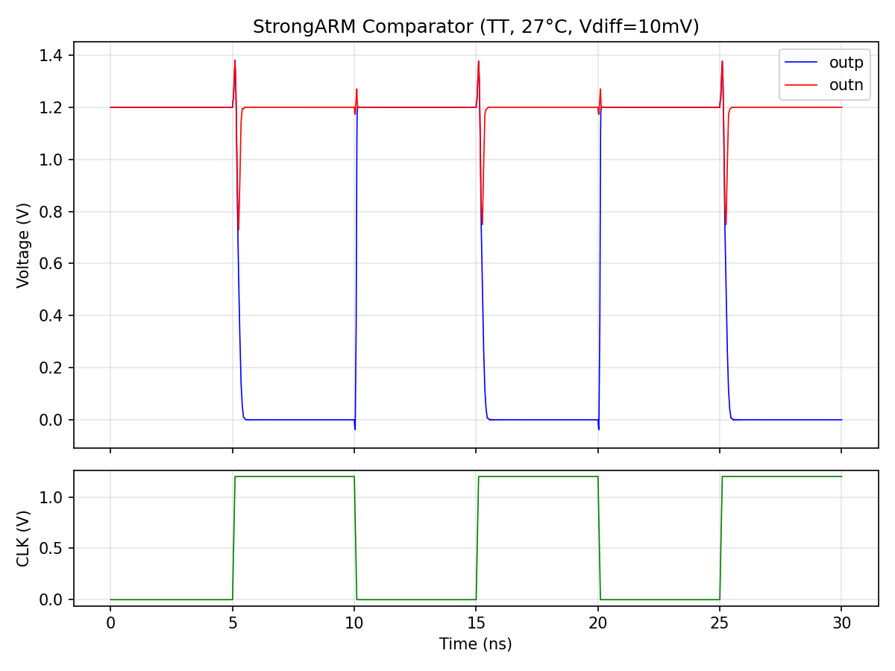

# sar_adc_8bit Datasheet

**8-bit successive-approximation ADC with StrongARM comparator**

| Field | Value |
|-------|-------|
| PDK | ihp-sg13g2 |
| Designer | shue |
| Created | March 3, 2026 |
| License | Apache 2.0 |
| Characterization Date | 2026-03-06 20:37 |
| Total Tests | 57 |
| Passed | 57 |
| Failed | 0 |
| **Overall** | **PASS** |

## Pin Description

| Pin | Direction | Type | Description |
|-----|-----------|------|-------------|
| clk | input | digital | Comparator/SAR clock (100 MHz) |
| rst_n | input | digital | Active-low asynchronous reset |
| vin | input | signal | Analog input voltage (0..vdd V) |
| start | input | digital | Start conversion (rising edge) |
| eoc | output | digital | End-of-conversion pulse |
| dout0 | output | digital | Digital output bit 0 (LSB) |
| dout1 | output | digital | Digital output bit 1 |
| dout2 | output | digital | Digital output bit 2 |
| dout3 | output | digital | Digital output bit 3 |
| dout4 | output | digital | Digital output bit 4 |
| dout5 | output | digital | Digital output bit 5 |
| dout6 | output | digital | Digital output bit 6 |
| dout7 | output | digital | Digital output bit 7 (MSB) |
| vdd | inout | power | Positive power supply / reference (1.08..1.32 V) |
| vss | inout | ground | Ground |

## Default Conditions

| Condition | Display | Typical | Unit |
|-----------|---------|---------|------|
| vdd | Vdd | 1.2 | V |
| temperature | Temp | 27 | °C |
| corner | Corner | mos_tt |  |

## Characterization Results

### Comparator Resolve Time

StrongARM comparator resolve time vs differential input

**Specifications:**

| Parameter | Display | Unit | Min | Max |
|-----------|---------|------|-----|-----|
| t_resolve | Resolve Time | ns |  | 5.0 |
| decision | Correct Decision |  | 1.0 |  |

**Results:**

| vdd | temperature | corner | vdiff | t_resolve | decision | Status |
|---|---|---|---|---|---|---|
| 1.2 | -40 | mos_tt | 1 | 0.3311 | 1.0000 | PASS |
| 1.2 | -40 | mos_tt | 5 | 0.2811 | 1.0000 | PASS |
| 1.2 | -40 | mos_tt | 10 | 0.2311 | 1.0000 | PASS |
| 1.2 | -40 | mos_tt | 50 | 0.1811 | 1.0000 | PASS |
| 1.2 | -40 | mos_tt | 100 | 0.1812 | 1.0000 | PASS |
| 1.2 | -40 | mos_ff | 1 | 0.2306 | 1.0000 | PASS |
| 1.2 | -40 | mos_ff | 5 | 0.1806 | 1.0000 | PASS |
| 1.2 | -40 | mos_ff | 10 | 0.1806 | 1.0000 | PASS |
| 1.2 | -40 | mos_ff | 50 | 0.1305 | 1.0000 | PASS |
| 1.2 | -40 | mos_ff | 100 | 0.1303 | 1.0000 | PASS |
| 1.2 | -40 | mos_ss | 1 | 0.5341 | 1.0000 | PASS |
| 1.2 | -40 | mos_ss | 5 | 0.3841 | 1.0000 | PASS |
| 1.2 | -40 | mos_ss | 10 | 0.3841 | 1.0000 | PASS |
| 1.2 | -40 | mos_ss | 50 | 0.2842 | 1.0000 | PASS |
| 1.2 | -40 | mos_ss | 100 | 0.2346 | 1.0000 | PASS |
| 1.2 | 27 | mos_tt | 1 | 0.3311 | 1.0000 | PASS |
| 1.2 | 27 | mos_tt | 5 | 0.2811 | 1.0000 | PASS |
| 1.2 | 27 | mos_tt | 10 | 0.2811 | 1.0000 | PASS |
| 1.2 | 27 | mos_tt | 50 | 0.1810 | 1.0000 | PASS |
| 1.2 | 27 | mos_tt | 100 | 0.1809 | 1.0000 | PASS |
| 1.2 | 27 | mos_ff | 1 | 0.2312 | 1.0000 | PASS |
| 1.2 | 27 | mos_ff | 5 | 0.1812 | 1.0000 | PASS |
| 1.2 | 27 | mos_ff | 10 | 0.1811 | 1.0000 | PASS |
| 1.2 | 27 | mos_ff | 50 | 0.1309 | 1.0000 | PASS |
| 1.2 | 27 | mos_ff | 100 | 0.1305 | 1.0000 | PASS |
| 1.2 | 27 | mos_ss | 1 | 0.4825 | 1.0000 | PASS |
| 1.2 | 27 | mos_ss | 5 | 0.3825 | 1.0000 | PASS |
| 1.2 | 27 | mos_ss | 10 | 0.3325 | 1.0000 | PASS |
| 1.2 | 27 | mos_ss | 50 | 0.2826 | 1.0000 | PASS |
| 1.2 | 27 | mos_ss | 100 | 0.2329 | 1.0000 | PASS |
| 1.2 | 130 | mos_tt | 1 | 0.3344 | 1.0000 | PASS |
| 1.2 | 130 | mos_tt | 5 | 0.2844 | 1.0000 | PASS |
| 1.2 | 130 | mos_tt | 10 | 0.2844 | 1.0000 | PASS |
| 1.2 | 130 | mos_tt | 50 | 0.1842 | 1.0000 | PASS |
| 1.2 | 130 | mos_tt | 100 | 0.1838 | 1.0000 | PASS |
| 1.2 | 130 | mos_ff | 1 | 0.2469 | 1.0000 | PASS |
| 1.2 | 130 | mos_ff | 5 | 0.2466 | 1.0000 | PASS |
| 1.2 | 130 | mos_ff | 10 | 0.1963 | 1.0000 | PASS |
| 1.2 | 130 | mos_ff | 50 | 0.1938 | 1.0000 | PASS |
| 1.2 | 130 | mos_ff | 100 | 0.1410 | 1.0000 | PASS |
| 1.2 | 130 | mos_ss | 1 | 0.4823 | 1.0000 | PASS |
| 1.2 | 130 | mos_ss | 5 | 0.3823 | 1.0000 | PASS |
| 1.2 | 130 | mos_ss | 10 | 0.3323 | 1.0000 | PASS |
| 1.2 | 130 | mos_ss | 50 | 0.2823 | 1.0000 | PASS |
| 1.2 | 130 | mos_ss | 100 | 0.2322 | 1.0000 | PASS |

**Plots:**

### Cap DAC Linearity

Binary-weighted cap DAC transfer function (ideal caps)

**Specifications:**

| Parameter | Display | Unit | Min | Max |
|-----------|---------|------|-----|-----|
| inl | INL | LSB |  | 0.5 |
| dnl | DNL | LSB |  | 0.5 |

**Results:**

| temperature | corner | vdd | inl | dnl | Status |
|---|---|---|---|---|---|
| 27 | mos_tt | 1.08 | 5.2633e-14 | 3.7970e-14 | PASS |
| 27 | mos_tt | 1.2 | 4.7370e-14 | 3.7970e-14 | PASS |
| 27 | mos_tt | 1.32 | 4.3063e-14 | 3.7748e-14 | PASS |

### SAR Full Conversion

Full SAR ADC conversion loop — analytical bit decisions driving real cap DAC

**Specifications:**

| Parameter | Display | Unit | Min | Max |
|-----------|---------|------|-----|-----|
| inl | INL | LSB |  | 0.5 |
| dnl | DNL | LSB |  | 0.5 |
| conv_time_ns | Conversion Time | ns |  | 1000 |

**Results:**

| temperature | vdd | corner | inl | dnl | conv_time_ns | Status |
|---|---|---|---|---|---|---|
| 27 | 1.08 | mos_tt | 5.2633e-14 | 6.7391e-14 | 800.0000 | PASS |
| 27 | 1.08 | mos_ff | 5.2633e-14 | 6.7391e-14 | 800.0000 | PASS |
| 27 | 1.08 | mos_ss | 5.2633e-14 | 6.7391e-14 | 800.0000 | PASS |
| 27 | 1.2 | mos_tt | 0.1244 | 0.1244 | 800.0000 | PASS |
| 27 | 1.2 | mos_ff | 0.1244 | 0.1244 | 800.0000 | PASS |
| 27 | 1.2 | mos_ss | 0.1244 | 0.1244 | 800.0000 | PASS |
| 27 | 1.32 | mos_tt | 0.1244 | 0.1244 | 800.0000 | PASS |
| 27 | 1.32 | mos_ff | 0.1244 | 0.1244 | 800.0000 | PASS |
| 27 | 1.32 | mos_ss | 0.1244 | 0.1244 | 800.0000 | PASS |

## Composite Plots

### Sar Comp Waveform

---
*Generated by run_cace_sims.py on 2026-03-06 20:37:01*
