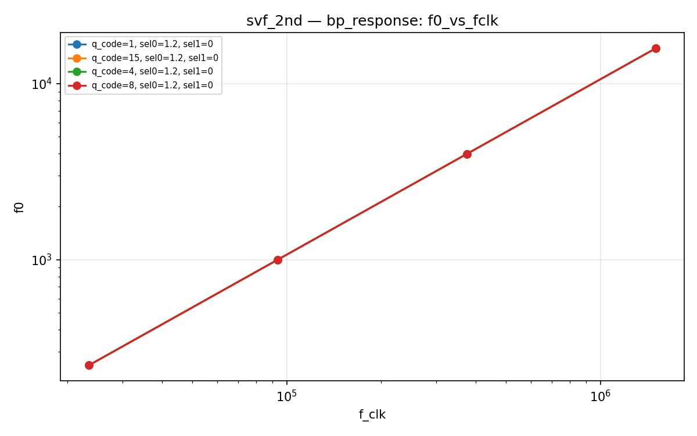
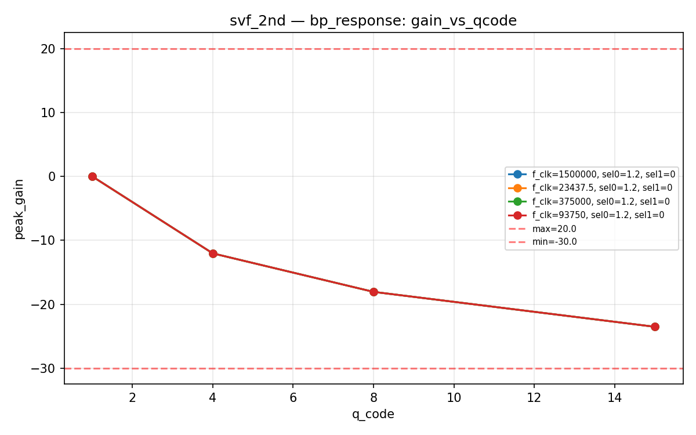
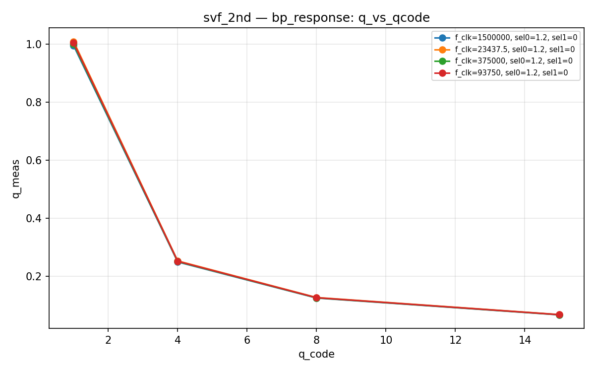
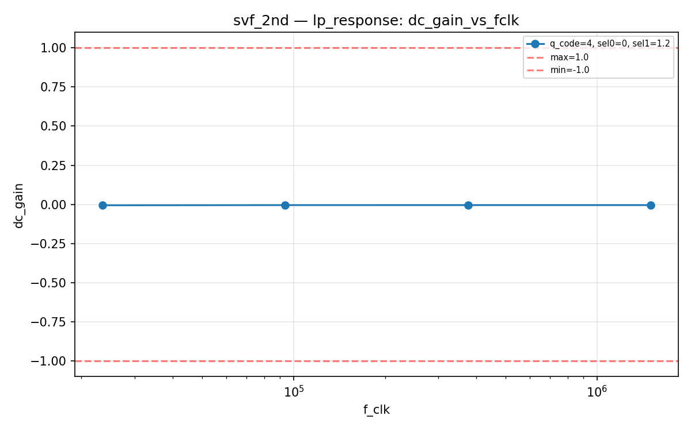
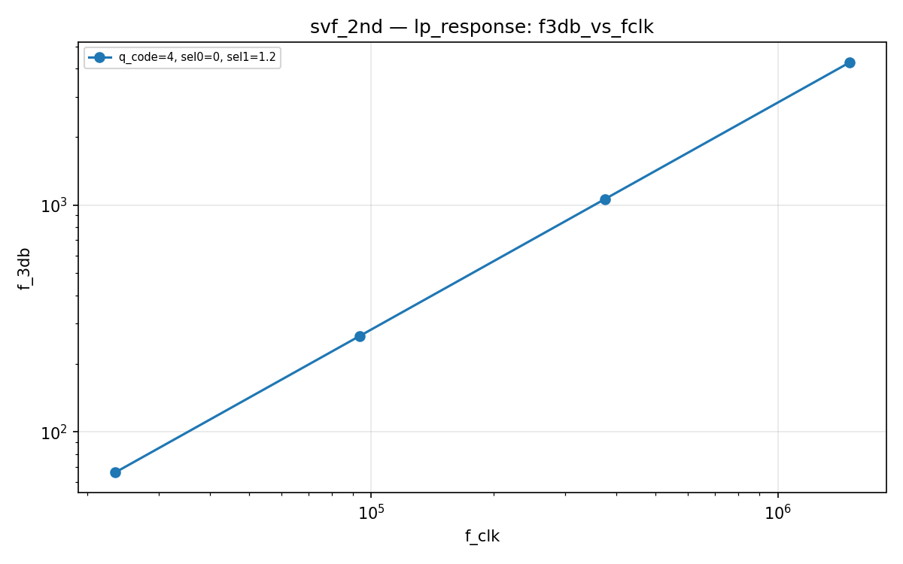
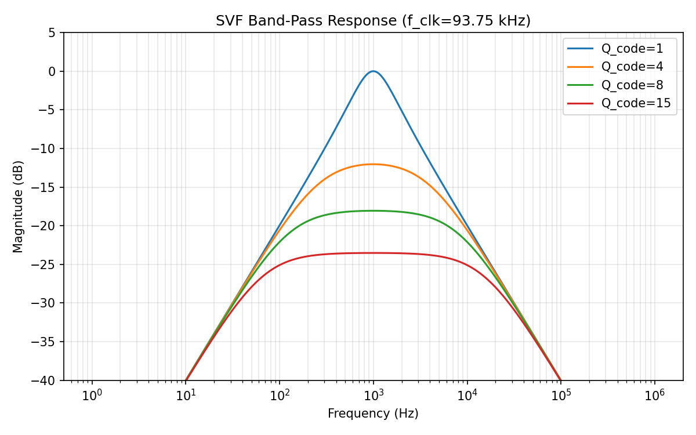
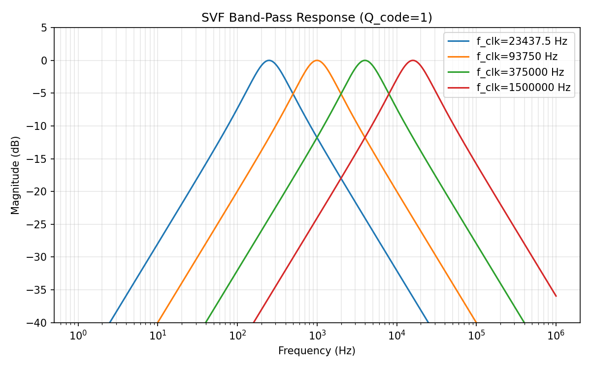
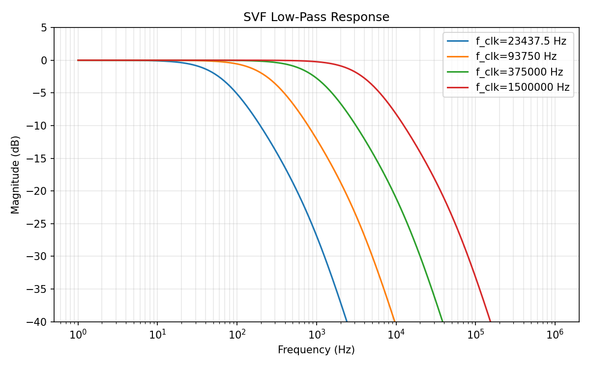

# svf_2nd Datasheet

**2nd-order SC state variable filter (Tow-Thomas biquad)**

| Field | Value |
|-------|-------|
| PDK | ihp-sg13g2 |
| Designer | shue |
| Created | March 3, 2026 |
| License | Apache 2.0 |
| Characterization Date | 2026-03-04 01:03 |
| Total Tests | 20 |
| Passed | 20 |
| Failed | 0 |
| **Overall** | **PASS** |

## Pin Description

| Pin | Direction | Type | Description |
|-----|-----------|------|-------------|
| vin | input | signal | Audio input signal (0..vdd V) |
| vout | output | signal | Filtered output (LP/BP/HP/bypass via sel mux) (0..vdd V) |
| sel0 | input | digital | Output mux select bit 0 |
| sel1 | input | digital | Output mux select bit 1 |
| sc_clk | input | digital | Switching clock (sets center frequency) |
| q0 | input | digital | Q tuning bit 0 (LSB) |
| q1 | input | digital | Q tuning bit 1 |
| q2 | input | digital | Q tuning bit 2 |
| q3 | input | digital | Q tuning bit 3 (MSB) |
| vdd | inout | power | Positive power supply (1.08..1.32 V) |
| vss | inout | ground | Ground |

## Default Conditions

| Condition | Display | Typical | Unit |
|-----------|---------|---------|------|
| vdd | Vdd | 1.2 | V |
| f_clk | f_clk | 93750 | Hz |
| q_code | Q code | 4 |  |
| sel0 | sel0 | 1.2 | V |
| sel1 | sel1 | 0 | V |

## Characterization Results

### Band-Pass Response

BP mode — center frequency, peak gain, and Q factor

**Specifications:**

| Parameter | Display | Unit | Min | Max |
|-----------|---------|------|-----|-----|
| f0 | Center Frequency | Hz | any | any |
| peak_gain | BP Peak Gain | dB | -30.0 | 20.0 |
| q_meas | Measured Q |  | any | any |

**Results:**

| vdd | sel0 | sel1 | f_clk | q_code | f0 | peak_gain | q_meas | Status |
|---|---|---|---|---|---|---|---|---|
| 1.2 | 1.2 | 0 | 23437.5 | 1 | 251.1886 | -0.0054 | 1.0097 | PASS |
| 1.2 | 1.2 | 0 | 23437.5 | 4 | 251.1886 | -12.0437 | 0.2525 | PASS |
| 1.2 | 1.2 | 0 | 23437.5 | 8 | 251.1886 | -18.0639 | 0.1263 | PASS |
| 1.2 | 1.2 | 0 | 23437.5 | 15 | 251.1886 | -23.5237 | 0.0673 | PASS |
| 1.2 | 1.2 | 0 | 93750 | 1 | 1000.0000 | -0.0045 | 1.0051 | PASS |
| 1.2 | 1.2 | 0 | 93750 | 4 | 1000.0000 | -12.0436 | 0.2513 | PASS |
| 1.2 | 1.2 | 0 | 93750 | 8 | 1000.0000 | -18.0639 | 0.1257 | PASS |
| 1.2 | 1.2 | 0 | 93750 | 15 | 1000.0000 | -23.5237 | 0.0670 | PASS |
| 1.2 | 1.2 | 0 | 375000 | 1 | 3981.0717 | -0.0044 | 1.0003 | PASS |
| 1.2 | 1.2 | 0 | 375000 | 4 | 3981.0717 | -12.0436 | 0.2501 | PASS |
| 1.2 | 1.2 | 0 | 375000 | 8 | 3981.0717 | -18.0639 | 0.1251 | PASS |
| 1.2 | 1.2 | 0 | 375000 | 15 | 3981.0717 | -23.5237 | 0.0667 | PASS |
| 1.2 | 1.2 | 0 | 1500000 | 1 | 1.5849e+04 | -0.0050 | 0.9954 | PASS |
| 1.2 | 1.2 | 0 | 1500000 | 4 | 1.5849e+04 | -12.0436 | 0.2490 | PASS |
| 1.2 | 1.2 | 0 | 1500000 | 8 | 1.5849e+04 | -18.0639 | 0.1245 | PASS |
| 1.2 | 1.2 | 0 | 1500000 | 15 | 1.5849e+04 | -23.5237 | 0.0664 | PASS |

**Plots:**

### Low-Pass Response

LP mode — DC gain and -3dB frequency

**Specifications:**

| Parameter | Display | Unit | Min | Max |
|-----------|---------|------|-----|-----|
| dc_gain | DC Gain | dB | -1.0 | 1.0 |
| f_3db | -3dB Frequency | Hz | any | any |

**Results:**

| vdd | sel0 | sel1 | f_clk | q_code | dc_gain | f_3db | Status |
|---|---|---|---|---|---|---|---|
| 1.2 | 0 | 1.2 | 23437.5 | 4 | -0.0053 | 66.2975 | PASS |
| 1.2 | 0 | 1.2 | 93750 | 4 | -0.0044 | 265.1339 | PASS |
| 1.2 | 0 | 1.2 | 375000 | 4 | -0.0044 | 1060.5206 | PASS |
| 1.2 | 0 | 1.2 | 1500000 | 4 | -0.0043 | 4242.0739 | PASS |

**Plots:**

## Composite Plots

### Svf Bp Bode Fclk93K

### Svf Bp Bode Q1

### Svf Lp Bode

---
*Generated by run_cace_sims.py on 2026-03-04 01:03:37*
